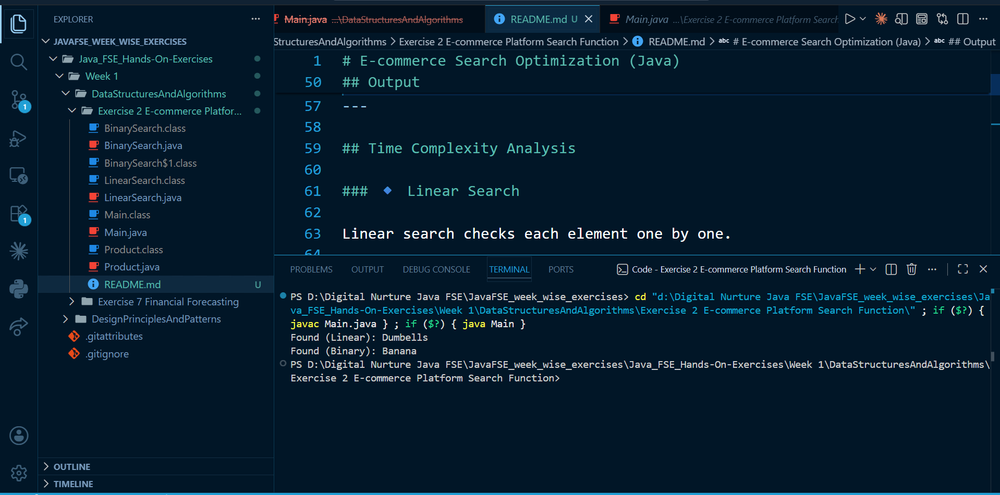

# E-commerce Search Optimization (Java)

## Overview

This project demonstrates how **search functionality** in an e-commerce platform can be optimized using **Data Structures and Algorithms (DSA)**.

It compares:

* **Linear Search**
* **Binary Search**

The goal is to understand performance differences and choose the most efficient approach.

---

## Files

* Product.java: Represents product data
* LinearSearch.java: Implements linear search
* BinarySearch.java: Implements binary search
* Main.java: Tests the implementation

---

## Implementation

* `Product` class stores:

  * productId
  * productName
  * category

* Linear search is applied on an **unsorted array**

* Binary search is applied on a **sorted array (by productId)**

* Sorting is done using `Arrays.sort()` with a custom comparator

---

## How to Run

```
javac *.java
java Main
```

---

## Output

```
Found (Linear): Dumbells
Found (Binary): Banana
```

---

## Time Complexity Analysis

### 🔹 Linear Search

Linear search checks each element one by one.

#### Best Case: O(1)

* Element is found at the first position
* Only one comparison is needed

#### Average Case: O(n)

* Element is somewhere in the middle
* About n/2 comparisons

#### Worst Case: O(n)

* Element is at the last position or not present
* All elements are checked

👉 **Explanation:**
The algorithm does not skip any elements, so time increases linearly with input size.

---

### 🔹 Binary Search

Binary search works by dividing the array into halves.

#### Best Case: O(1)

* Element is found at the middle

#### Average Case: O(log n)

* Search space reduces by half each time

#### Worst Case: O(log n)

* Continues dividing until one element remains

👉 **Explanation:**
Each step reduces the problem size:

```
n → n/2 → n/4 → n/8 → ...
```

Number of steps = log₂(n)

---

### 🔹 Sorting Cost (Important Insight)

Before binary search:

```
Sorting → O(n log n)
Searching → O(log n)
```

👉 If only one search is needed:

* Linear search may be better (no sorting cost)

👉 If multiple searches are needed:

* Sort once, then use binary search repeatedly

---

## Conclusion

* Linear search is simple but inefficient for large datasets
* Binary search is significantly faster but requires sorted data
* For real-world systems, efficient searching is achieved using:

  * Hashing
  * Indexing
  * Search engines

---

## Screenshot


