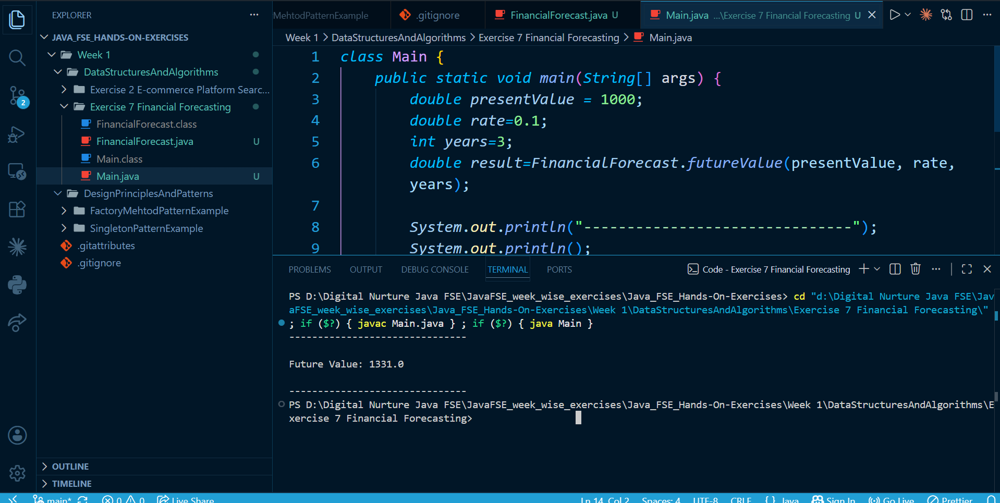

# Financial Forecasting using Recursion (Java)

## Overview

This project demonstrates how **recursion** can be used to predict future financial values based on past data and growth rates.

It models a simple financial forecasting system where the future value of an investment is calculated over a number of years.

---

## Files

* FinancialForecast.java: Contains recursive, iterative, and optimized methods
* Main.java: Tests the implementation

---

## Implementation

* The future value is calculated using:

```text
Future Value = Present Value × (1 + growth rate)
```

* Recursive approach breaks the problem into smaller subproblems:

```text
FV(n) = FV(n-1) × (1 + rate)
```

* Three approaches are implemented:

  * Recursive method
  * Iterative method
  * Optimized mathematical method

---

## How to Run

```
javac *.java
java Main
```

---

## Output

```
Future Value: 1331.0
```

---

## 🔁 Recursion Concept

Recursion is a technique where a function **calls itself** to solve smaller instances of a problem.

### Key Components:

* **Base Case** → Stops recursion
* **Recursive Case** → Reduces problem size

### Why it simplifies problems:

* Breaks complex problems into smaller subproblems
* Matches naturally with mathematical formulas
* Makes code more intuitive for repetitive calculations

In this project, recursion mirrors the financial formula:

```text
FV(n) = FV(n-1) × (1 + rate)
```

---

## ⏱️ Time Complexity Analysis

### Recursive Approach

Recurrence:

```text
T(n) = T(n-1) + O(1)
```

### Final Complexity:

* **Time Complexity:** O(n)
* **Space Complexity:** O(n) (due to recursion stack)

### Explanation:

* Each recursive call reduces the problem by 1 year
* Total number of calls = n
* Each call performs constant work

---

## ⚡ Optimization of Recursive Solution

### Problem with Recursion:

* Uses extra memory (call stack)
* Function call overhead
* Not efficient for large inputs

---

### ✅ Optimized Approach 1: Iterative

```java
for (int i = 0; i < years; i++) {
    result = result * (1 + rate);
}
```

* Time Complexity → O(n)
* Space Complexity → O(1)

---

### ✅ Optimized Approach 2: Mathematical Formula

```java
result = presentValue * Math.pow(1 + rate, years);
```

* Time Complexity → O(log n)
* Space Complexity → O(1)

---

### 🚀 Why Optimization Works

* Iteration removes recursion stack overhead
* Mathematical formula avoids repeated computation
* Reduces execution time for large inputs

---

## Conclusion

* Recursion provides a clean and intuitive solution
* However, it is not always the most efficient
* Iterative and mathematical approaches offer better performance

---

## Screenshot


