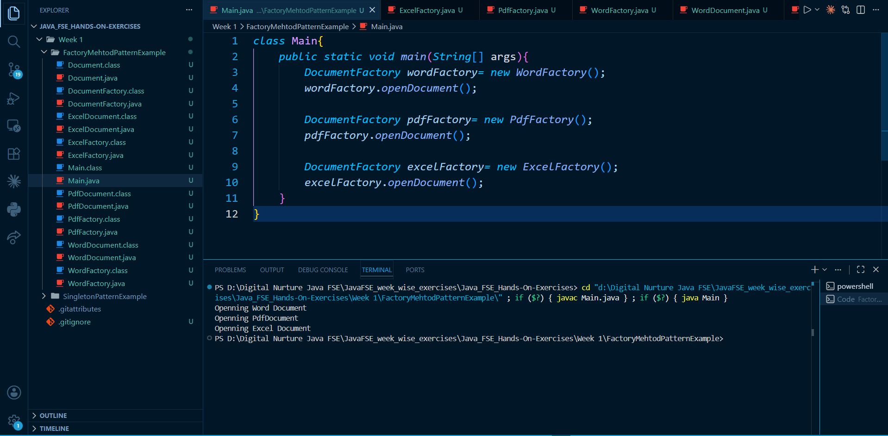

# Factory Method Pattern Example (Java)

## Overview

This project demonstrates the Factory Method Design Pattern in Java. It is used to create different types of documents (Word, PDF, Excel) without exposing the object creation logic.

## Files

* Document.java: Interface for all document types
* WordDocument.java, PdfDocument.java, ExcelDocument.java: Concrete document classes
* DocumentFactory.java: Abstract factory class
* WordFactory.java, PdfFactory.java, ExcelFactory.java: Concrete factories
* Main.java: Tests the implementation

## Implementation

* Common interface `Document` for all document types
* Abstract factory `DocumentFactory` defines `createDocument()`
* Concrete factories override the method to create specific objects
* Object creation is handled by factories, not the main class

## How to Run

```
javac *.java
java Main
```

## Output

```
Opening Word Document
Opening PDF Document
Opening Excel Document
```

## Flow

```
Main
  ↓
DocumentFactory (Reference)
  ↓
Concrete Factory (WordFactory / PdfFactory / ExcelFactory)
  ↓
createDocument()
  ↓
Concrete Document (WordDocument / PdfDocument / ExcelDocument)
  ↓
open()
  ↓
Output
```

## Screenshot


