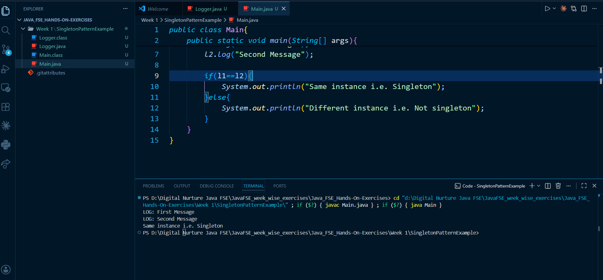

# Singleton Pattern Example (Java)

## Overview

This project demonstrates the Singleton Design Pattern in Java. It ensures that only one instance of the Logger class is created and used throughout the application.

## Files

* Logger.java: Implements the Singleton pattern
* Main.java: Tests the implementation

## Implementation

* Private constructor to prevent object creation
* Static instance variable
* Public static getInstance() method to access the instance

## How to Run

```
javac *.java
java Main
```

## Output

```
Logger Created
LOG: First Message
LOG: Second Message
Same instance
```

## Screenshot


