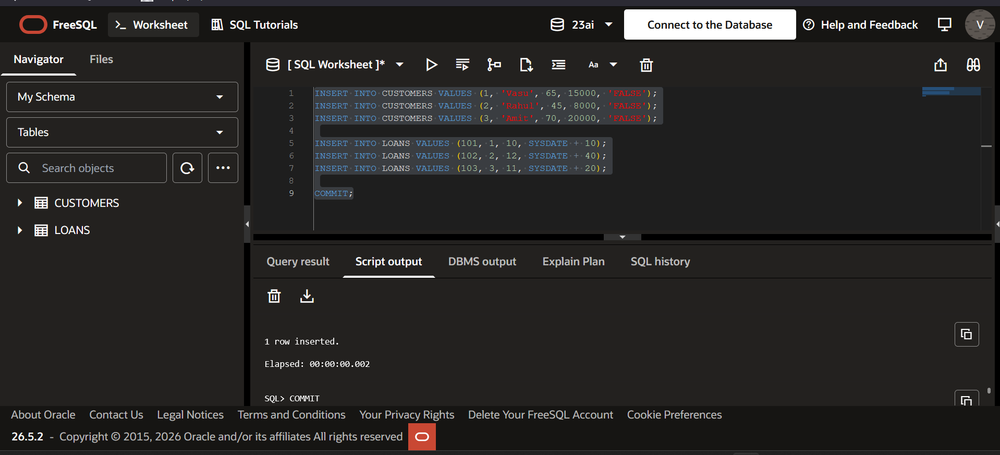
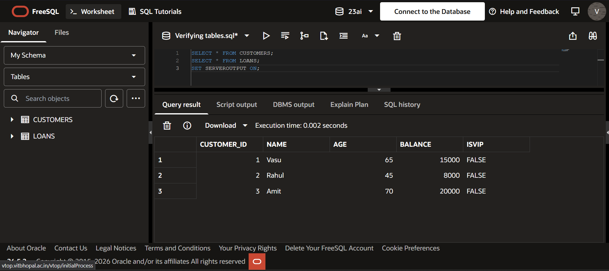
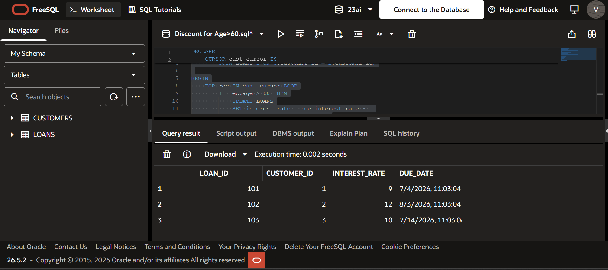
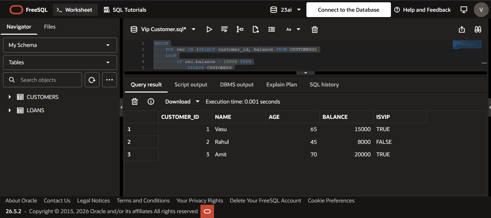
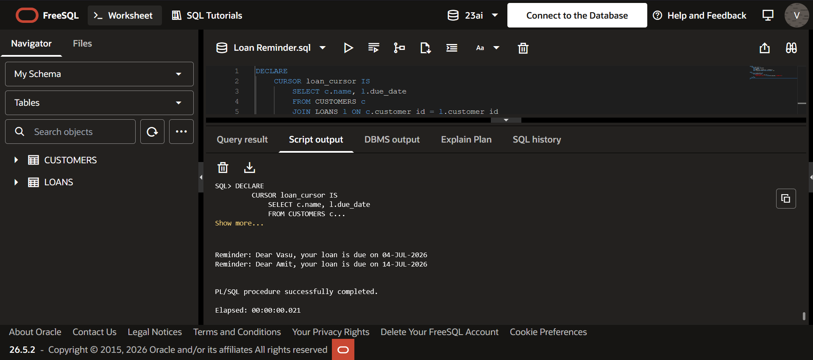

# PL/SQL Control Structures Exercise

## Overview

This project demonstrates the implementation of PL/SQL control structures such as loops, cursors, and conditional statements using Oracle Live SQL.

---

## Database Schema

### Tables

* CUSTOMERS
* LOANS

---

## Scenarios Implemented

### Scenario 1: Senior Citizen Discount

A 1% reduction in loan interest rate is applied to customers whose age is greater than 60.

### Scenario 2: VIP Customer Identification

Customers with a balance greater than 10,000 are marked as VIP.

### Scenario 3: Loan Reminder System

Reminders are generated for customers whose loan due date falls within the next 30 days.

---

## Technologies Used

* Oracle SQL
* PL/SQL
* Oracle Live SQL

---

## Screenshots

### Tables Created

### Data Inserted

### Scenario 1 Output

### Scenario 2 Output

### Scenario 3 Output

---

## How to Run

1. Execute `schema.sql` to create tables
2. Execute `inserts.sql` to populate data
3. Run each scenario file individually

---

## Concepts Covered

* Cursors
* Loops
* Conditional Statements (IF)
* DBMS_OUTPUT
* Date Handling using SYSDATE

---
