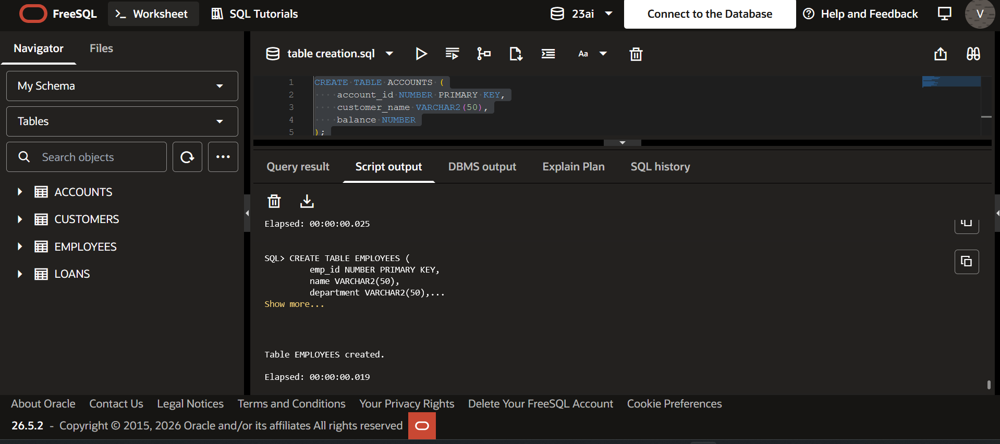
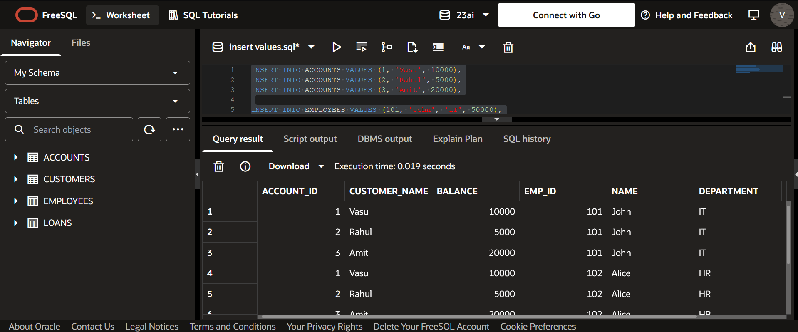
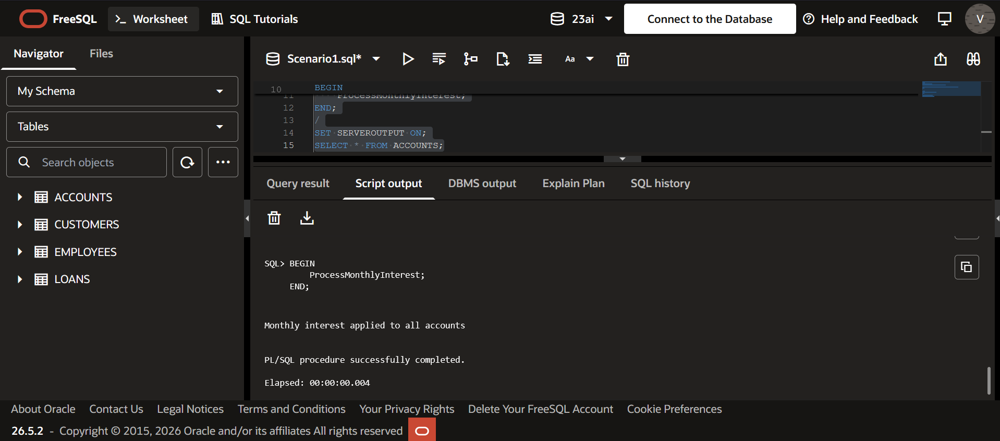
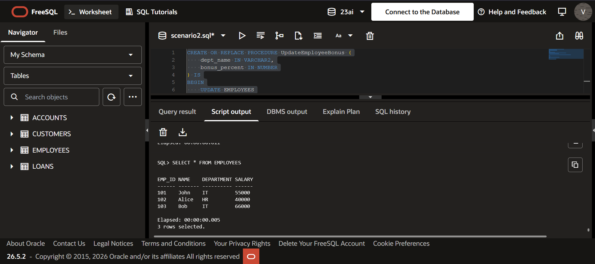
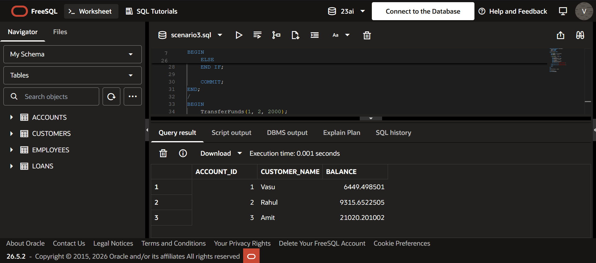

# PL/SQL Stored Procedures Exercise

## Overview

This project demonstrates the implementation of PL/SQL stored procedures to handle common banking operations such as interest calculation, employee bonus updates, and fund transfers.

---

## Database Schema

### Tables

* ACCOUNTS
* EMPLOYEES

---

## Scenarios Implemented

### Scenario 1: Process Monthly Interest

A stored procedure `ProcessMonthlyInterest` updates all account balances by applying a 1% interest rate.

### Scenario 2: Update Employee Bonus

A stored procedure `UpdateEmployeeBonus` increases employee salaries for a given department based on a bonus percentage provided as input.

### Scenario 3: Transfer Funds Between Accounts

A stored procedure `TransferFunds` transfers a specified amount from one account to another after validating sufficient balance in the source account.

---

## Technologies Used

* Oracle SQL
* PL/SQL
* Oracle Live SQL

---

## Stored Procedures

### ProcessMonthlyInterest

* Applies 1% interest to all account balances.

### UpdateEmployeeBonus

* Parameters:

  * `dept_name` (VARCHAR2)
  * `bonus_percent` (NUMBER)
* Updates salaries based on department.

### TransferFunds

* Parameters:

  * `from_acc` (NUMBER)
  * `to_acc` (NUMBER)
  * `amount` (NUMBER)
* Performs balance validation before transfer.

---

## Screenshots

### Tables Created

### Data Inserted

### Interest Processing Output

### Employee Bonus Output

### Fund Transfer Output

---

## How to Run

1. Execute `schema.sql` to create tables
2. Execute `inserts.sql` to populate initial data
3. Create each stored procedure using the provided SQL files
4. Execute procedures using anonymous PL/SQL blocks
5. Verify results using SELECT queries

---

## Concepts Covered

* Stored Procedures
* Parameter Passing (IN parameters)
* Conditional Logic (IF statements)
* Data Manipulation (UPDATE)
* Transaction Control (COMMIT)
* SELECT INTO usage

---
