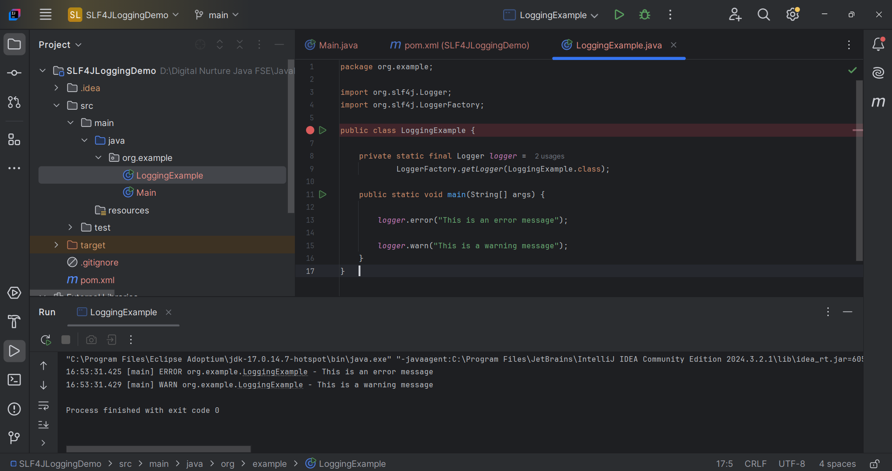

# SLF4J Exercise 1 – Logging Error Messages and Warning Levels

## Overview

This project demonstrates the use of **SLF4J (Simple Logging Facade for Java)** with **Logback** for logging messages in a Java application.

Logging is an essential part of software development that helps developers monitor application behavior, debug issues, and record important events. In this exercise, SLF4J is used as the logging API, while Logback acts as the logging implementation.

The application logs two different severity levels:

- **ERROR** – Used to log error conditions.
- **WARN** – Used to log warning messages.

---

## Technologies Used

- Java (JDK 17)
- Apache Maven (3.9.x)
- SLF4J API (1.7.30)
- Logback Classic (1.2.3)
- IntelliJ IDEA Community Edition

---

## Project Structure

```
SLF4JLoggingDemo/
├── pom.xml
├── src/
│   └── main/
│       └── java/
│           └── org/
│               └── example/
│                   └── LoggingExample.java
├── .gitignore
└── README.md
```

---

## Dependency Configuration

The following dependencies are added in `pom.xml` to enable logging using SLF4J and Logback:

```xml
<dependency>
    <groupId>org.slf4j</groupId>
    <artifactId>slf4j-api</artifactId>
    <version>1.7.30</version>
</dependency>

<dependency>
    <groupId>ch.qos.logback</groupId>
    <artifactId>logback-classic</artifactId>
    <version>1.2.3</version>
</dependency>
```

---

## Application Code

### LoggingExample.java

```java
package org.example;

import org.slf4j.Logger;
import org.slf4j.LoggerFactory;

public class LoggingExample {

    private static final Logger logger =
            LoggerFactory.getLogger(LoggingExample.class);

    public static void main(String[] args) {

        logger.error("This is an error message");

        logger.warn("This is a warning message");
    }
}
```

---

## Logging Concepts Demonstrated

### Logger

A logger object is created using `LoggerFactory`.

```java
private static final Logger logger =
        LoggerFactory.getLogger(LoggingExample.class);
```

The logger is responsible for recording messages at different logging levels.

---

### Error Logging

The `error()` method logs serious problems that require immediate attention.

```java
logger.error("This is an error message");
```

Example Output:

```text
ERROR org.example.LoggingExample - This is an error message
```

---

### Warning Logging

The `warn()` method logs warning messages that indicate potential issues but do not stop program execution.

```java
logger.warn("This is a warning message");
```

Example Output:

```text
WARN org.example.LoggingExample - This is a warning message
```

---

## Logging Levels Used

| Logging Level | Description |
|--------------|-------------|
| `ERROR` | Logs critical errors that require attention. |
| `WARN` | Logs warning messages indicating possible issues. |

---

## Build and Execution

To compile and run the project using Maven:

```bash
mvn clean compile
mvn exec:java -Dexec.mainClass="org.example.LoggingExample"
```

Or execute the application directly from IntelliJ IDEA by selecting:

```
Run 'LoggingExample'
```

---

## Expected Result

- The application starts successfully.
- An **ERROR** message is logged.
- A **WARN** message is logged.
- Logback formats and displays the log messages in the console.
- The application exits successfully with exit code **0**.

---

## Output

Include a screenshot of the successful application execution.

Example:

```markdown

```

---

## Key Learnings

- Understanding the purpose of application logging.
- Using SLF4J as a logging facade.
- Configuring Logback as the logging implementation.
- Creating logger instances with `LoggerFactory`.
- Logging messages using different severity levels.
- Differentiating between **ERROR** and **WARN** logging.
- Running Maven-based Java applications with logging support.

---

## Conclusion

- This exercise demonstrates how to integrate **SLF4J** with **Logback** to implement logging in Java applications.
- By using different logging levels such as **ERROR** and **WARN**, developers can effectively monitor application behavior and troubleshoot issues.
- SLF4J provides a clean abstraction over logging frameworks, making applications more maintainable and flexible.