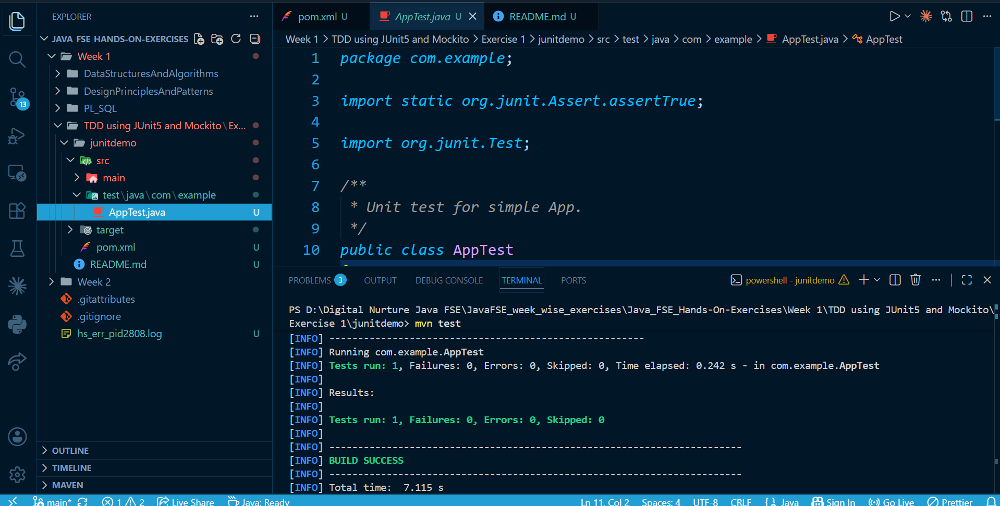

# JUnit Exercise 1 – Maven Setup and Unit Testing

## Overview

This project demonstrates the setup of a Java application using Maven and the integration of JUnit for unit testing. It includes a basic test case to verify the correct configuration and execution of tests.

---

## Technologies Used

* Java (JDK 17)
* Maven (3.9.x)
* JUnit 4.13.2

---

## Project Structure

```
junitdemo/
├── pom.xml
├── src/
│   ├── main/java/com/example/
│   │   └── App.java
│   └── test/java/com/example/
│       └── AppTest.java
```

---

## Dependency Configuration

The following dependency is added in `pom.xml` to enable JUnit testing:

```xml
<dependency>
    <groupId>junit</groupId>
    <artifactId>junit</artifactId>
    <version>4.13.2</version>
    <scope>test</scope>
</dependency>
```

---

## Test Implementation

A basic unit test is implemented to validate the test framework setup:

```java
package com.example;

import org.junit.Test;
import static org.junit.Assert.*;

public class AppTest {

    @Test
    public void shouldAnswerWithTrue() {
        assertTrue(true);
    }
}
```

---

## Build and Execution

To compile the project and run tests, execute the following command from the project root directory:

```
mvn test
```

---

## Expected Result

* The test executes successfully.
* Maven build completes with a `BUILD SUCCESS` status.

---
## Output




---

## Key Learnings

* Setting up a Maven-based Java project.
* Managing dependencies using `pom.xml`.
* Writing unit tests using JUnit.
* Executing tests using Maven lifecycle commands.

---

## Conclusion

* The project confirms successful integration of JUnit with a Maven-based 
* Java application and demonstrates basic unit test execution.
