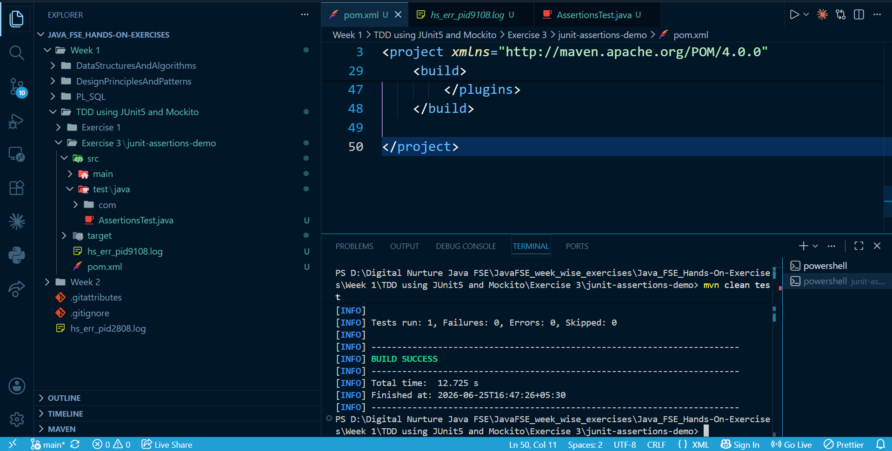

# JUnit Exercise 3 – Assertions in JUnit 5

## Overview

This project demonstrates the usage of **JUnit 5 assertion methods** to validate different test conditions. Assertions are the foundation of unit testing and are used to compare expected and actual results, verify boolean conditions, and validate object references.

The exercise showcases the most commonly used assertion methods available in JUnit 5 through a simple test class.

---

## Technologies Used

* Java (JDK 17)
* Apache Maven (3.9.x)
* JUnit Jupiter (JUnit 5.10.2)

---

## Project Structure

```
junit-assertions-demo/
├── pom.xml
├── src/
│   ├── main/
│   │   └── java/
│   └── test/
│       └── java/
│           └── AssertionsTest.java
```

---

## Dependency Configuration

The following dependency is added in `pom.xml` to enable JUnit 5 testing:

```xml
<dependency>
    <groupId>org.junit.jupiter</groupId>
    <artifactId>junit-jupiter</artifactId>
    <version>5.10.2</version>
    <scope>test</scope>
</dependency>
```

---

## Test Implementation

The test class demonstrates the use of different JUnit assertion methods.

```java
import org.junit.jupiter.api.Test;
import static org.junit.jupiter.api.Assertions.*;

public class AssertionsTest {

    @Test
    public void testAssertions() {

        assertEquals(5, 2 + 3);

        assertTrue(5 > 3);

        assertFalse(5 < 3);

        assertNull(null);

        assertNotNull(new Object());
    }
}
```

---

## Assertions Used

| Assertion         | Description                                             |
| ----------------- | ------------------------------------------------------- |
| `assertEquals()`  | Verifies that the expected and actual values are equal. |
| `assertTrue()`    | Verifies that the given condition evaluates to `true`.  |
| `assertFalse()`   | Verifies that the given condition evaluates to `false`. |
| `assertNull()`    | Verifies that the object reference is `null`.           |
| `assertNotNull()` | Verifies that the object reference is not `null`.       |

---

## Build and Execution

To compile the project and execute the test cases, run the following command from the project root directory:

```bash
mvn clean test
```

---

## Expected Result

* The JUnit test executes successfully.
* All assertions pass without failures.
* Maven completes the build with a **BUILD SUCCESS** status.

---

## Output

Include a screenshot of the successful Maven execution.

```text
-------------------------------------------------------
 T E S T S
-------------------------------------------------------
Running AssertionsTest

Tests run: 1
Failures: 0
Errors: 0
Skipped: 0

BUILD SUCCESS
```

Example:

```markdown

```

---

## Key Learnings

* Understanding the purpose of assertions in unit testing.
* Using different assertion methods provided by JUnit 5.
* Writing reliable and readable unit tests.
* Executing JUnit test cases using Maven.
* Interpreting Maven test execution reports.

---

## Conclusion

* This exercise demonstrates the effective use of JUnit 5 assertions to validate expected outcomes during unit testing.
* It provides a foundation for writing reliable, maintainable, and automated test cases in Java applications.
