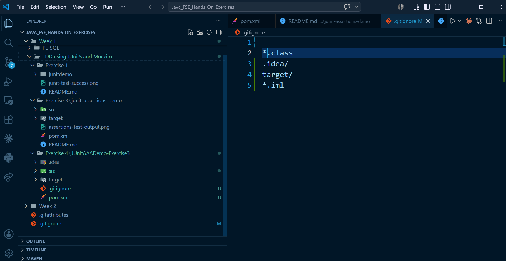

# JUnit Exercise 4 – Arrange-Act-Assert (AAA) Pattern, Test Fixtures, Setup and Teardown

## Overview

This project demonstrates the implementation of the **Arrange-Act-Assert (AAA) Pattern** in **JUnit 5** along with the use of **Test Fixtures**, **Setup**, and **Teardown** methods.

The exercise uses a simple `Calculator` class to perform arithmetic operations and verifies the correctness of the methods using JUnit test cases. It also demonstrates how to initialize common test resources before each test and clean them up afterward.

---

## Technologies Used

* Java (JDK 17)
* Apache Maven (3.9.x)
* JUnit Jupiter (JUnit 5.10.2)
* IntelliJ IDEA Community Edition

---

## Project Structure

```
JUnitAAADemo-Exercise3/
├── pom.xml
├── src/
│   ├── main/
│   │   └── java/
│   │       └── org/
│   │           └── example/
│   │               └── Calculator.java
│   └── test/
│       └── java/
│           └── org/
│               └── example/
│                   └── CalculatorTest.java
├── .gitignore
└── README.md
```

---

## Dependency Configuration

The following dependency is added in `pom.xml` to enable JUnit 5 testing:

```xml
<dependency>
    <groupId>org.junit.jupiter</groupId>
    <artifactId>junit-jupiter</artifactId>
    <version>5.10.2</version>
    <scope>test</scope>
</dependency>
```

---

## Application Code

### Calculator.java

```java
package org.example;

public class Calculator {

    public int add(int a, int b) {
        return a + b;
    }

    public int multiply(int a, int b) {
        return a * b;
    }
}
```

---

## Test Implementation

### CalculatorTest.java

```java
package org.example;

import org.junit.jupiter.api.*;

import static org.junit.jupiter.api.Assertions.*;

public class CalculatorTest {

    Calculator calculator;

    @BeforeEach
    void setUp() {
        calculator = new Calculator();
        System.out.println("Setup: Calculator object created");
    }

    @AfterEach
    void tearDown() {
        calculator = null;
        System.out.println("Teardown: Calculator object destroyed");
    }

    @Test
    void testAddition() {

        // Arrange
        int a = 10;
        int b = 20;

        // Act
        int result = calculator.add(a, b);

        // Assert
        assertEquals(30, result);
    }

    @Test
    void testMultiplication() {

        // Arrange
        int a = 5;
        int b = 4;

        // Act
        int result = calculator.multiply(a, b);

        // Assert
        assertEquals(20, result);
    }
}
```

---

## Arrange-Act-Assert (AAA) Pattern

The test methods follow the AAA testing pattern:

### Arrange
Prepare the required input data and test environment.

```java
int a = 10;
int b = 20;
```

### Act
Execute the method being tested.

```java
int result = calculator.add(a, b);
```

### Assert
Verify that the actual result matches the expected result.

```java
assertEquals(30, result);
```

---

## Test Fixtures

The `Calculator` object acts as the **Test Fixture**, providing a common object shared by all test methods.

```java
Calculator calculator;
```

The fixture is initialized before each test and cleaned up after each test.

---

## Setup and Teardown Methods

### Setup Method

```java
@BeforeEach
void setUp() {
    calculator = new Calculator();
}
```

- Executes before every test case.
- Creates a fresh `Calculator` object.
- Ensures each test starts with a clean environment.

---

### Teardown Method

```java
@AfterEach
void tearDown() {
    calculator = null;
}
```

- Executes after every test case.
- Releases resources and cleans up the test fixture.

---

## JUnit Annotations Used

| Annotation | Description |
|------------|-------------|
| `@Test` | Marks a method as a test case. |
| `@BeforeEach` | Executes before each test method to perform setup. |
| `@AfterEach` | Executes after each test method to perform cleanup. |

---

## Assertions Used

| Assertion | Description |
|-----------|-------------|
| `assertEquals()` | Verifies that the expected and actual values are equal. |

---

## Build and Execution

To compile the project and execute the test cases, run the following command from the project root directory:

```bash
mvn clean test
```

Or execute the test class directly from IntelliJ IDEA by selecting:

```
Run 'CalculatorTest'
```

---

## Expected Result

* Both test cases execute successfully.
* Setup and Teardown methods execute before and after every test.
* All assertions pass successfully.
* Maven completes the execution with a **BUILD SUCCESS** status.

---

## Output

Include a screenshot of the successful test execution.

Example:

```markdown

```

---

## Key Learnings

* Understanding the Arrange-Act-Assert (AAA) testing pattern.
* Creating and using Test Fixtures in JUnit.
* Using `@BeforeEach` for test setup.
* Using `@AfterEach` for test cleanup.
* Writing independent and reusable unit tests.
* Verifying application behavior using `assertEquals()`.
* Executing JUnit 5 test cases using Maven and IntelliJ IDEA.

---

## Conclusion

* This exercise demonstrates the implementation of the Arrange-Act-Assert (AAA) Pattern using JUnit 5.
* It illustrates how Setup and Teardown methods improve test organization and maintainability.
* The use of Test Fixtures ensures that each test executes in an isolated and consistent environment, resulting in reliable and repeatable unit tests.