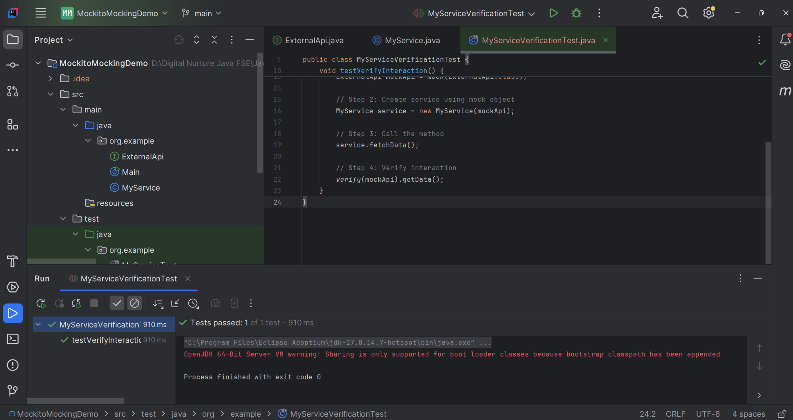

---

# JUnit Exercise 6 – Verifying Interactions using Mockito

## Overview

This exercise demonstrates how to use **Mockito's verification feature** to ensure that a mocked object's method is invoked during the execution of a test.

Unlike the previous exercise, which focused on **Mocking** and **Stubbing**, this exercise focuses on verifying that the service correctly interacts with its dependency.

The `MyService` class calls the `getData()` method of the mocked `ExternalApi`, and Mockito's `verify()` method confirms that the interaction actually occurred.

---

## Test Implementation

### MyServiceVerificationTest.java

```java
package org.example;

import org.junit.jupiter.api.Test;

import static org.mockito.Mockito.*;

public class MyServiceVerificationTest {

    @Test
    void testVerifyInteraction() {

        // Step 1: Create mock object
        ExternalApi mockApi = mock(ExternalApi.class);

        // Step 2: Create service using mock object
        MyService service = new MyService(mockApi);

        // Step 3: Call the method
        service.fetchData();

        // Step 4: Verify interaction
        verify(mockApi).getData();
    }
}
```

---

## Mockito Concept Demonstrated

### Verifying Interactions

Mockito allows developers to verify whether a method on a mocked object was invoked during test execution.

```java
verify(mockApi).getData();
```

This statement verifies that the `getData()` method of the mocked `ExternalApi` was called exactly once by the `fetchData()` method of `MyService`.

---

## Mockito Method Used

| Method | Description |
|--------|-------------|
| `verify()` | Confirms that a mocked method was invoked during test execution. |

---

## Build and Execution

To compile the project and execute the verification test, run the following command from the project root directory:

```bash
mvn clean test
```

Or execute the test class directly from IntelliJ IDEA by selecting:

```
Run 'MyServiceVerificationTest'
```

---

## Expected Result

* The mock object is successfully created.
* The `fetchData()` method invokes `getData()` on the mocked dependency.
* Mockito successfully verifies the interaction.
* The test executes without any failures.
* Maven completes the execution with a **BUILD SUCCESS** status.

---

## Output

Include a screenshot of the successful verification test execution.

Example:



---

## Key Learnings

* Understanding interaction verification in Mockito.
* Using `verify()` to ensure methods are invoked.
* Testing collaboration between classes without relying on real implementations.
* Writing reliable unit tests that validate object interactions.
* Executing Mockito verification tests using Maven and IntelliJ IDEA.

---

## Conclusion

* This exercise demonstrates how Mockito's `verify()` method can be used to confirm interactions between a class and its dependencies.
* Interaction verification helps ensure that the expected methods are invoked during execution, improving the reliability and correctness of unit tests.
* Combined with Mocking and Stubbing, verification provides a complete approach to testing isolated components in Java applications.

---

# JUnit Exercise 6 – Verifying Interactions using Mockito

## Overview

This exercise demonstrates how to use **Mockito's verification feature** to ensure that a mocked object's method is invoked during the execution of a test.

Unlike the previous exercise, which focused on **Mocking** and **Stubbing**, this exercise focuses on verifying that the service correctly interacts with its dependency.

The `MyService` class calls the `getData()` method of the mocked `ExternalApi`, and Mockito's `verify()` method confirms that the interaction actually occurred.

---

## Test Implementation

### MyServiceVerificationTest.java

```java
package org.example;

import org.junit.jupiter.api.Test;

import static org.mockito.Mockito.*;

public class MyServiceVerificationTest {

    @Test
    void testVerifyInteraction() {

        // Step 1: Create mock object
        ExternalApi mockApi = mock(ExternalApi.class);

        // Step 2: Create service using mock object
        MyService service = new MyService(mockApi);

        // Step 3: Call the method
        service.fetchData();

        // Step 4: Verify interaction
        verify(mockApi).getData();
    }
}
```

---

## Mockito Concept Demonstrated

### Verifying Interactions

Mockito allows developers to verify whether a method on a mocked object was invoked during test execution.

```java
verify(mockApi).getData();
```

This statement verifies that the `getData()` method of the mocked `ExternalApi` was called exactly once by the `fetchData()` method of `MyService`.

---

## Mockito Method Used

| Method | Description |
|--------|-------------|
| `verify()` | Confirms that a mocked method was invoked during test execution. |

---

## Build and Execution

To compile the project and execute the verification test, run the following command from the project root directory:

```bash
mvn clean test
```

Or execute the test class directly from IntelliJ IDEA by selecting:

```
Run 'MyServiceVerificationTest'
```

---

## Expected Result

* The mock object is successfully created.
* The `fetchData()` method invokes `getData()` on the mocked dependency.
* Mockito successfully verifies the interaction.
* The test executes without any failures.
* Maven completes the execution with a **BUILD SUCCESS** status.

---

## Output

Include a screenshot of the successful verification test execution.

Example:


---

## Key Learnings

* Understanding interaction verification in Mockito.
* Using `verify()` to ensure methods are invoked.
* Testing collaboration between classes without relying on real implementations.
* Writing reliable unit tests that validate object interactions.
* Executing Mockito verification tests using Maven and IntelliJ IDEA.

---

## Conclusion

* This exercise demonstrates how Mockito's `verify()` method can be used to confirm interactions between a class and its dependencies.
* Interaction verification helps ensure that the expected methods are invoked during execution, improving the reliability and correctness of unit tests.
* Combined with Mocking and Stubbing, verification provides a complete approach to testing isolated components in Java applications.