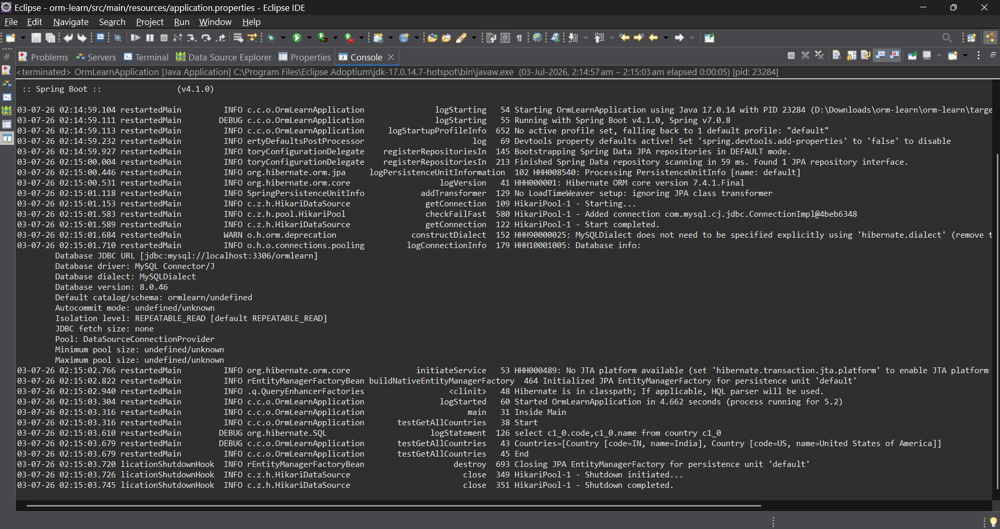

# Spring Data JPA Exercise – Quick Example

## Overview

This project demonstrates the implementation of **Spring Data JPA** with **Spring Boot** and **MySQL**. It focuses on configuring a Spring Boot application, mapping a database table to a Java entity using JPA annotations, creating a repository with `JpaRepository`, implementing a service layer, and retrieving data from a MySQL database.

The application fetches all records from the `country` table and displays them in the console using Spring Boot logging.

---

## Technologies Used

* Java (JDK 17)
* Spring Boot (4.1.0)
* Spring Data JPA
* Hibernate ORM
* MySQL Server 8.0
* Maven (3.9.x)
* Eclipse IDE for Enterprise Java Developers

---

## Project Structure

```
orm-learn/
├── pom.xml
├── src/
│   ├── main/
│   │   ├── java/
│   │   │   └── com/
│   │   │       └── cognizant/
│   │   │           └── ormlearn/
│   │   │               ├── model/
│   │   │               │   └── Country.java
│   │   │               ├── repository/
│   │   │               │   └── CountryRepository.java
│   │   │               ├── service/
│   │   │               │   └── CountryService.java
│   │   │               └── OrmLearnApplication.java
│   │   │
│   │   └── resources/
│   │       └── application.properties
│   │
│   └── test/
│       └── java/
│
├── screenshots/
│   ├── database-output.png
│   └── application-output.png
│
├── .gitignore
└── README.md
```

---

## Database Configuration

Database Name

```sql
ormlearn
```

### Create Country Table

```sql
CREATE TABLE country (
    code VARCHAR(2) PRIMARY KEY,
    name VARCHAR(50)
);
```

### Insert Sample Records

```sql
INSERT INTO country VALUES ('IN', 'India');
INSERT INTO country VALUES ('US', 'United States of America');
```

---

## Spring Boot Configuration

The database connection is configured in **application.properties**.

```properties
spring.datasource.url=jdbc:mysql://localhost:3306/ormlearn
spring.datasource.username=root
spring.datasource.password=********
spring.datasource.driver-class-name=com.mysql.cj.jdbc.Driver

spring.jpa.hibernate.ddl-auto=validate
```

Logging is enabled to display SQL queries executed by Hibernate.

---

## JPA Entity

The `Country` class is mapped to the `country` table using JPA annotations.

```java
@Entity
@Table(name = "country")
public class Country {
    @Id
    @Column(name = "code")
    private String code;

    @Column(name = "name")
    private String name;
}
```

The entity uses:

- `@Entity` to mark it as a JPA entity.
- `@Table` to map it to the database table.
- `@Id` to specify the primary key.
- `@Column` to map Java fields to table columns.

---

## Repository Layer

The project uses Spring Data JPA's `JpaRepository` to perform database operations.

```java
@Repository
public interface CountryRepository extends JpaRepository<Country, String> {

}
```

The repository provides built-in CRUD operations without writing SQL queries.

---

## Service Layer

The service layer retrieves all countries using the repository.

```java
@Service
public class CountryService {

    @Autowired
    private CountryRepository countryRepository;

    @Transactional
    public List<Country> getAllCountries() {
        return countryRepository.findAll();
    }
}
```

---

## Application Flow

1. Spring Boot application starts.
2. Spring initializes the Application Context.
3. `CountryService` bean is retrieved.
4. `testGetAllCountries()` is executed.
5. `JpaRepository.findAll()` fetches all records.
6. Hibernate generates the SQL query.
7. Retrieved countries are displayed in the console.

---

## Build and Execution

Run the project using Maven:

```bash
mvn clean package
```

or execute

```bash
mvn spring-boot:run
```

You can also run `OrmLearnApplication.java` directly from Eclipse.

---

## Expected Result

* Spring Boot application starts successfully.
* MySQL database connection is established.
* Hibernate executes the SQL query.
* All records from the `country` table are retrieved.
* The application displays the list of countries in the console.

Example Output:

```text
Started OrmLearnApplication

Inside Main

Start

select c1_0.code,c1_0.name
from country c1_0

Countries=[Country [code=IN, name=India],
Country [code=US, name=United States of America]]

End
```

---

## Output

### Database Output

Include a screenshot of the `country` table in MySQL Workbench.

```markdown

```

---

### Application Output

Include a screenshot of the Eclipse console showing successful execution.

```markdown

```

---

## Key Learnings

* Creating a Spring Boot project using Spring Initializr.
* Configuring MySQL connectivity using `application.properties`.
* Mapping Java classes to database tables using JPA annotations.
* Using `JpaRepository` for CRUD operations.
* Implementing the Service layer using Spring.
* Managing transactions with `@Transactional`.
* Retrieving records using Spring Data JPA.
* Understanding Hibernate SQL logging.
* Using Dependency Injection with `@Autowired`.

---

## Conclusion

* This exercise demonstrates the integration of **Spring Boot**, **Spring Data JPA**, and **MySQL** to perform database operations.
* Spring Data JPA significantly reduces boilerplate code by providing ready-to-use repository methods.
* Hibernate automatically translates repository operations into SQL queries, making database interaction simpler and more efficient.
* This project serves as a foundation for building enterprise-level Spring Boot applications using the Repository-Service architecture.

---
