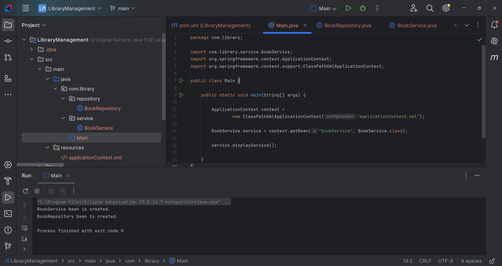

# Spring Core Exercise 1 – Configuring a Basic Spring Application

## Overview

This project demonstrates the basic configuration of a **Spring Core Application** using **XML-based Bean Configuration**.

The application simulates a simple **Library Management System**, where Spring's **Inversion of Control (IoC)** container manages the creation and dependency injection of application components.

In this exercise, two beans—`BookService` and `BookRepository`—are defined in the Spring configuration file (`applicationContext.xml`). The application loads the Spring container, retrieves the service bean, and demonstrates dependency injection.

---

## Technologies Used

* Java (JDK 17)
* Apache Maven (3.9.x)
* Spring Framework (Spring Context 5.3.37)
* IntelliJ IDEA Community Edition

---

## Project Structure

```
LibraryManagement/
├── pom.xml
├── src/
│   └── main/
│       ├── java/
│       │   └── com/
│       │       └── library/
│       │           ├── Main.java
│       │           ├── repository/
│       │           │   └── BookRepository.java
│       │           └── service/
│       │               └── BookService.java
│       └── resources/
│           └── applicationContext.xml
├── .gitignore
└── README.md
```

---

## Dependency Configuration

The following dependency is added in `pom.xml` to enable Spring Core functionality:

```xml
<dependency>
    <groupId>org.springframework</groupId>
    <artifactId>spring-context</artifactId>
    <version>5.3.37</version>
</dependency>
```

---

## Application Classes

### BookRepository.java

```java
package com.library.repository;

public class BookRepository {

    public void displayRepository() {
        System.out.println("BookRepository bean is created.");
    }
}
```

---

### BookService.java

```java
package com.library.service;

import com.library.repository.BookRepository;

public class BookService {

    private BookRepository repository;

    public void setRepository(BookRepository repository) {
        this.repository = repository;
    }

    public void displayService() {
        System.out.println("BookService bean is created.");
        repository.displayRepository();
    }
}
```

---

### Main.java

```java
package com.library;

import com.library.service.BookService;
import org.springframework.context.ApplicationContext;
import org.springframework.context.support.ClassPathXmlApplicationContext;

public class Main {

    public static void main(String[] args) {

        ApplicationContext context =
                new ClassPathXmlApplicationContext("applicationContext.xml");

        BookService service =
                context.getBean("bookService", BookService.class);

        service.displayService();
    }
}
```

---

## Spring Configuration

### applicationContext.xml

```xml
<?xml version="1.0" encoding="UTF-8"?>

<beans xmlns="http://www.springframework.org/schema/beans"
       xmlns:xsi="http://www.w3.org/2001/XMLSchema-instance"
       xsi:schemaLocation="
       http://www.springframework.org/schema/beans
       https://www.springframework.org/schema/beans/spring-beans.xsd">

    <bean id="bookRepository"
          class="com.library.repository.BookRepository"/>

    <bean id="bookService"
          class="com.library.service.BookService">

        <property name="repository"
                  ref="bookRepository"/>

    </bean>

</beans>
```

---

## Spring Concepts Demonstrated

### Inversion of Control (IoC)

Spring manages the creation and lifecycle of application objects (beans) instead of the developer creating them manually.

---

### Dependency Injection (DI)

The `BookRepository` object is injected into `BookService` using **Setter Injection**.

```xml
<property name="repository" ref="bookRepository"/>
```

---

### Bean Configuration

Beans are defined inside the Spring XML configuration file.

```xml
<bean id="bookRepository"
      class="com.library.repository.BookRepository"/>
```

---

### Application Context

The Spring IoC container is loaded using:

```java
ApplicationContext context =
    new ClassPathXmlApplicationContext("applicationContext.xml");
```

---

## Build and Execution

To compile and run the application:

```bash
mvn clean compile
```

Run the application using IntelliJ IDEA:

```
Run 'Main.main()'
```

---

## Expected Result

* Spring successfully loads the XML configuration.
* The `BookRepository` bean is created.
* The `BookService` bean is created.
* Spring injects the repository bean into the service bean.
* The application executes successfully without errors.

Expected Console Output:

```text
BookService bean is created.
BookRepository bean is created.
```

---

## Output

Include a screenshot of the successful application execution.

Example:

```markdown

```

---

## Key Learnings

* Understanding the Spring IoC Container.
* Configuring beans using XML.
* Creating and managing Spring Beans.
* Implementing Dependency Injection using Setter Injection.
* Loading the Spring Application Context.
* Retrieving beans from the IoC container.
* Building a basic Spring Core application using Maven.

---

## Conclusion

* This exercise demonstrates the fundamentals of the Spring Framework by configuring a simple Library Management application using XML-based configuration.
* It illustrates how Spring's IoC container manages bean creation and dependency injection, promoting loose coupling and easier application maintenance.
* Understanding these concepts forms the foundation for developing larger enterprise applications using the Spring ecosystem.