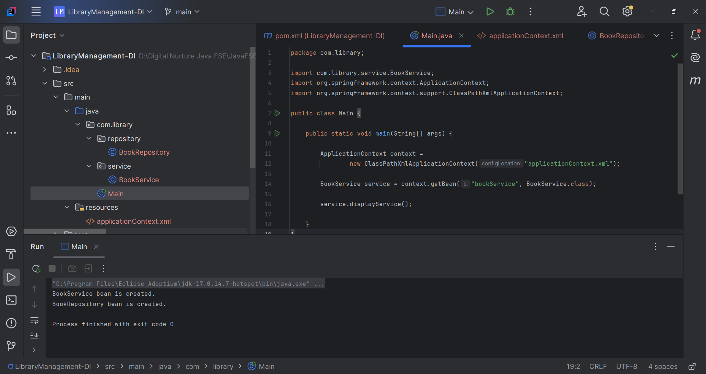

# Spring Core Exercise 2 – Implementing Dependency Injection

## Overview

This project demonstrates **Dependency Injection (DI)** using the **Spring Framework** in a simple **Library Management System**.

Dependency Injection is one of the core features of Spring's **Inversion of Control (IoC)** container. Instead of creating dependent objects manually, Spring manages the creation of beans and injects the required dependencies automatically.

In this exercise, the `BookRepository` bean is injected into the `BookService` bean using **Setter-Based Dependency Injection** configured through the **applicationContext.xml** file.

---

## Technologies Used

* Java (JDK 17)
* Apache Maven (3.9.x)
* Spring Framework (Spring Context 5.3.37)
* IntelliJ IDEA Community Edition

---

## Project Structure

```
LibraryManagement-DI/
├── pom.xml
├── src/
│   └── main/
│       ├── java/
│       │   └── com/
│       │       └── library/
│       │           ├── Main.java
│       │           ├── repository/
│       │           │   └── BookRepository.java
│       │           └── service/
│       │               └── BookService.java
│       └── resources/
│           └── applicationContext.xml
├── .gitignore
└── README.md
```

---

## Dependency Configuration

The following dependency is added in `pom.xml` to enable Spring Core functionality:

```xml
<dependency>
    <groupId>org.springframework</groupId>
    <artifactId>spring-context</artifactId>
    <version>5.3.37</version>
</dependency>
```

---

## Application Classes

### BookRepository.java

```java
package com.library.repository;

public class BookRepository {

    public void displayRepository() {
        System.out.println("BookRepository bean is created.");
    }
}
```

---

### BookService.java

```java
package com.library.service;

import com.library.repository.BookRepository;

public class BookService {

    private BookRepository repository;

    public void setRepository(BookRepository repository) {
        this.repository = repository;
    }

    public void displayService() {
        System.out.println("BookService bean is created.");
        repository.displayRepository();
    }
}
```

---

### Main.java

```java
package com.library;

import com.library.service.BookService;
import org.springframework.context.ApplicationContext;
import org.springframework.context.support.ClassPathXmlApplicationContext;

public class Main {

    public static void main(String[] args) {

        ApplicationContext context =
                new ClassPathXmlApplicationContext("applicationContext.xml");

        BookService service =
                context.getBean("bookService", BookService.class);

        service.displayService();
    }
}
```

---

## Spring XML Configuration

### applicationContext.xml

```xml
<?xml version="1.0" encoding="UTF-8"?>

<beans xmlns="http://www.springframework.org/schema/beans"
       xmlns:xsi="http://www.w3.org/2001/XMLSchema-instance"
       xsi:schemaLocation="
       http://www.springframework.org/schema/beans
       https://www.springframework.org/schema/beans/spring-beans.xsd">

    <bean id="bookRepository"
          class="com.library.repository.BookRepository"/>

    <bean id="bookService"
          class="com.library.service.BookService">

        <property name="repository"
                  ref="bookRepository"/>

    </bean>

</beans>
```

---

## Dependency Injection Demonstrated

### Setter-Based Dependency Injection

The dependency is injected using the setter method of `BookService`.

```java
public void setRepository(BookRepository repository) {
    this.repository = repository;
}
```

Spring injects the dependency through the following XML configuration:

```xml
<property name="repository" ref="bookRepository"/>
```

---

## Spring Concepts Covered

### Inversion of Control (IoC)

The Spring IoC container is responsible for creating and managing application beans.

---

### Dependency Injection (DI)

Instead of creating a `BookRepository` object manually inside `BookService`, Spring injects it automatically using XML configuration.

This promotes:

- Loose Coupling
- Better Maintainability
- Improved Testability
- Easier Component Management

---

### Bean Wiring

Spring wires the `BookRepository` bean into the `BookService` bean through XML configuration.

```xml
<property name="repository" ref="bookRepository"/>
```

---

## Build and Execution

To compile the project:

```bash
mvn clean compile
```

Run the application using IntelliJ IDEA:

```
Run 'Main.main()'
```

---

## Expected Result

* Spring successfully loads the XML configuration.
* The `BookRepository` bean is created.
* The `BookService` bean is created.
* Spring injects the repository bean into the service bean using Setter Injection.
* The application executes successfully.

Expected Console Output:

```text
BookService bean is created.
BookRepository bean is created.
```

---

## Output

Include a screenshot of the successful application execution.

Example:

```markdown

```

---

## Key Learnings

* Understanding Spring Dependency Injection (DI).
* Implementing Setter-Based Dependency Injection.
* Configuring dependencies using XML.
* Managing beans using the Spring IoC Container.
* Understanding bean wiring with the `<property>` tag.
* Developing loosely coupled applications using Spring Framework.

---

## Conclusion

* This exercise demonstrates how Spring's Dependency Injection mechanism simplifies object creation and dependency management.
* By using Setter-Based Dependency Injection, the `BookService` class remains loosely coupled with the `BookRepository` class.
* Spring's IoC container automatically manages bean creation and dependency wiring, making applications easier to maintain, test, and extend.