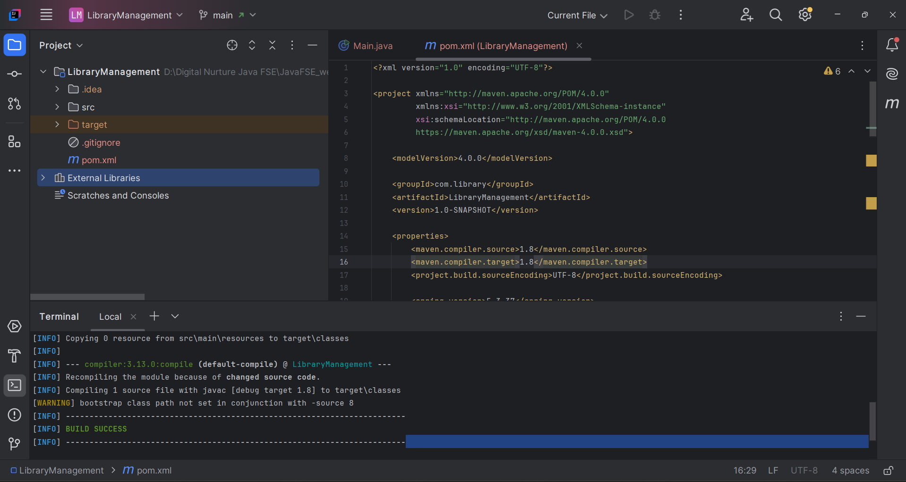

# Spring Core Exercise 4 – Creating and Configuring a Maven Project

## Overview

This project demonstrates how to create and configure a **Maven-based Spring Framework project** for a simple Library Management application.

The exercise focuses on setting up the project structure, adding essential Spring Framework dependencies, and configuring the Maven Compiler Plugin to compile Java source code using Java 1.8 compatibility.

---

## Technologies Used

* Java (JDK 17)
* Apache Maven (3.9.x)
* Spring Framework (5.3.37)
* IntelliJ IDEA Community Edition

---

## Project Structure

```
LibraryManagement/
├── pom.xml
├── src/
│   ├── main/
│   │   ├── java/
│   │   └── resources/
│   └── test/
│       └── java/
├── target/
├── .gitignore
└── README.md
```

---

## Maven Coordinates

```xml
<groupId>com.library</groupId>
<artifactId>LibraryManagement</artifactId>
<version>1.0-SNAPSHOT</version>
```

---

## Spring Dependencies

The project includes the following Spring Framework modules.

### Spring Context

```xml
<dependency>
    <groupId>org.springframework</groupId>
    <artifactId>spring-context</artifactId>
    <version>5.3.37</version>
</dependency>
```

Provides the Spring IoC Container and Dependency Injection support.

---

### Spring AOP

```xml
<dependency>
    <groupId>org.springframework</groupId>
    <artifactId>spring-aop</artifactId>
    <version>5.3.37</version>
</dependency>
```

Provides Aspect-Oriented Programming (AOP) support.

---

### Spring Web MVC

```xml
<dependency>
    <groupId>org.springframework</groupId>
    <artifactId>spring-webmvc</artifactId>
    <version>5.3.37</version>
</dependency>
```

Provides the Spring MVC framework for building web applications.

---

## Maven Compiler Plugin

The Maven Compiler Plugin is configured to compile the project with Java 1.8 compatibility.

```xml
<build>
    <plugins>

        <plugin>

            <groupId>org.apache.maven.plugins</groupId>
            <artifactId>maven-compiler-plugin</artifactId>
            <version>3.13.0</version>

            <configuration>
                <source>1.8</source>
                <target>1.8</target>
            </configuration>

        </plugin>

    </plugins>
</build>
```

---

## Build and Execution

Compile the project using Maven:

```bash
mvn clean compile
```

Or use IntelliJ IDEA's Maven integration to build the project.

---

## Expected Result

* Maven successfully downloads all required Spring dependencies.
* The project compiles without errors.
* The Maven Compiler Plugin compiles the project using Java 1.8 compatibility.
* Maven displays a **BUILD SUCCESS** message after compilation.

Example Output:

```text
[INFO] Compiling source files...
[INFO] BUILD SUCCESS
```

---

## Output

Include a screenshot of the successful Maven build.

Example:

```markdown

```

---

## Key Learnings

* Creating a Maven-based Java project.
* Understanding Maven project structure.
* Managing project dependencies using `pom.xml`.
* Adding Spring Framework modules to a project.
* Configuring the Maven Compiler Plugin.
* Compiling projects using Maven.
* Understanding Maven coordinates (`groupId`, `artifactId`, and `version`).

---

## Conclusion

* This exercise demonstrates the process of setting up a Maven project for a Spring application.
* By adding the required Spring dependencies and configuring the Maven Compiler Plugin, the project is prepared for Spring-based application development.
* Maven simplifies dependency management, build automation, and project configuration, making it an essential tool for modern Java development.