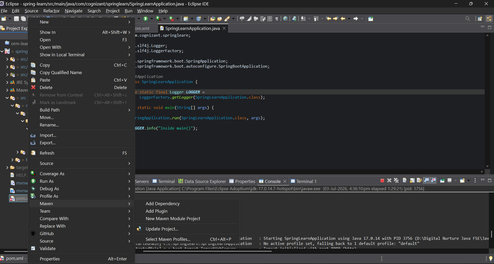
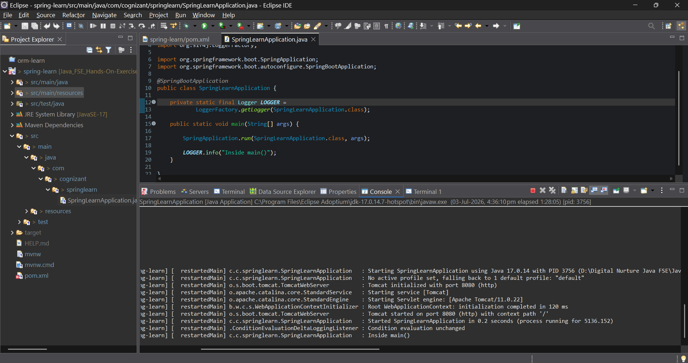
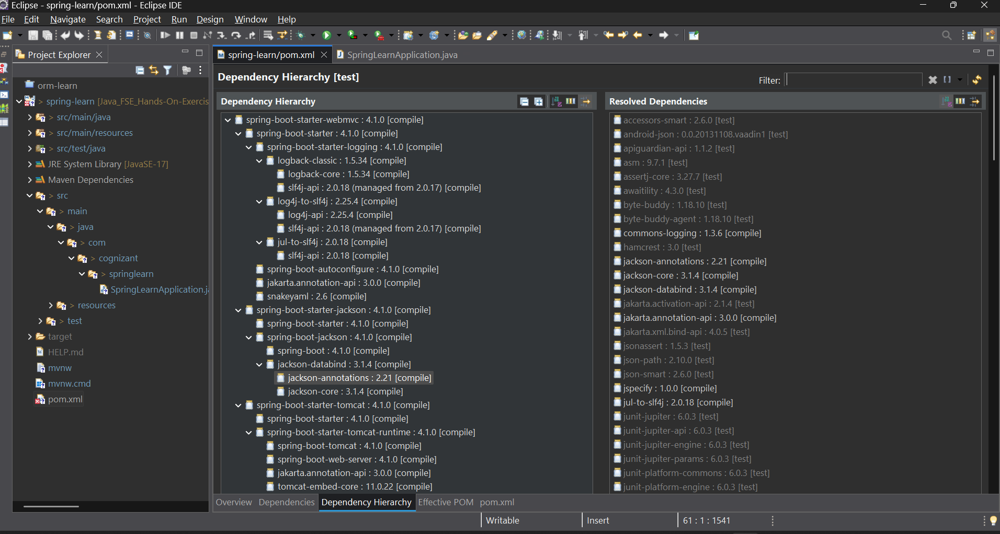

# Spring Boot Exercise 1 – Create a Spring Web Project using Maven

## Overview

This project demonstrates the creation of a **Spring Boot Web Application** using **Maven** and **Spring Initializr**. The exercise focuses on setting up a Spring Boot project, configuring Maven dependencies, verifying successful application startup, and understanding the project structure and Maven dependency management.

The application uses **Spring Boot DevTools** and **Spring Web** to create a basic web application with an embedded Tomcat server.

---

## Technologies Used

* Java (JDK 17)
* Spring Boot 4.1.0
* Spring Web
* Spring Boot DevTools
* Apache Maven (3.9.x)
* Eclipse IDE for Enterprise Java Developers

---

## Project Structure

```
spring-learn/
├── pom.xml
├── src/
│   ├── main/
│   │   ├── java/
│   │   │   └── com/
│   │   │       └── cognizant/
│   │   │           └── springlearn/
│   │   │               └── SpringLearnApplication.java
│   │   │
│   │   └── resources/
│   │       └── application.properties
│   │
│   └── test/
│       └── java/
│
├── screenshots/
│   ├── maven-build-output.png
│   ├── dependency-hierarchy.png
│   └── application-output.png
│
├── .gitignore
└── README.md
```

---

## Project Configuration

The project was generated using **Spring Initializr** with the following configuration:

| Property | Value |
|----------|-------|
| Group | `com.cognizant` |
| Artifact | `spring-learn` |
| Packaging | Jar |
| Java Version | 17 |

---

## Dependencies Used

The project includes the following Spring Boot starters.

### Spring Boot DevTools

Provides automatic restart and improved development experience.

```xml
<dependency>
    <groupId>org.springframework.boot</groupId>
    <artifactId>spring-boot-devtools</artifactId>
    <scope>runtime</scope>
    <optional>true</optional>
</dependency>
```

---

### Spring Web

Provides support for building RESTful web applications using Spring MVC and includes an embedded Tomcat server.

```xml
<dependency>
    <groupId>org.springframework.boot</groupId>
    <artifactId>spring-boot-starter-web</artifactId>
</dependency>
```

---

## Logging Configuration

To verify the execution of the `main()` method, logging was added using **SLF4J**.

```java
private static final Logger LOGGER =
        LoggerFactory.getLogger(SpringLearnApplication.class);

public static void main(String[] args) {

    SpringApplication.run(SpringLearnApplication.class, args);

    LOGGER.info("Inside main()");
}
```

---

## Build and Execution

Build the project using Maven:

```bash
mvn clean package
```

Run the application by executing:

```bash
mvn spring-boot:run
```

or directly run:

```
SpringLearnApplication.java
```

from Eclipse.

---

## Expected Result

* Maven successfully downloads all required dependencies.
* The project builds successfully.
* Spring Boot application starts without errors.
* Embedded Tomcat starts on port **8080**.
* The log message **"Inside main()"** is displayed in the console.

Example Output:

```text
Starting SpringLearnApplication...

Tomcat started on port(s): 8080 (http)

Started SpringLearnApplication

Inside main()
```

---

## Output

### Maven Build Output

Include the screenshot of the successful Maven build.





---

### Application Output

Include the screenshot of the Spring Boot application console.





---

### Dependency Hierarchy

Include the screenshot of the Maven Dependency Hierarchy.




---

## Project Walkthrough

### `src/main/java`

Contains the Java source code of the application, including the main Spring Boot class and other application components.

### `src/main/resources`

Contains application configuration files such as `application.properties`, static resources, and templates.

### `src/test/java`

Contains unit and integration test classes for the application.

### `SpringLearnApplication.java`

Contains the `main()` method, which starts the Spring Boot application.

```java
SpringApplication.run(SpringLearnApplication.class, args);
```

---

### Purpose of `@SpringBootApplication`

The `@SpringBootApplication` annotation combines the following three annotations:

- `@Configuration`
- `@EnableAutoConfiguration`
- `@ComponentScan`

It enables Spring Boot auto-configuration, component scanning, and Java-based configuration, allowing the application to start with minimal setup.

---

### `pom.xml`

The `pom.xml` file manages:

- Project metadata
- Maven dependencies
- Build plugins
- Spring Boot parent configuration
- Dependency management

---

## Key Learnings

* Creating a Spring Boot project using Spring Initializr.
* Understanding the Maven project structure.
* Managing dependencies using Maven.
* Running a Spring Boot application.
* Understanding the role of `@SpringBootApplication`.
* Using SLF4J logging.
* Building projects using Maven.
* Understanding the Maven Dependency Hierarchy.

---

## Conclusion

This exercise demonstrates how to create a Spring Boot web project using Maven and Spring Initializr. By configuring the required dependencies, building the project with Maven, and running the application successfully, it provides a strong foundation for developing Spring Boot web applications. The exercise also introduces the standard Maven project structure and highlights the role of dependency management in modern Java development.

---
