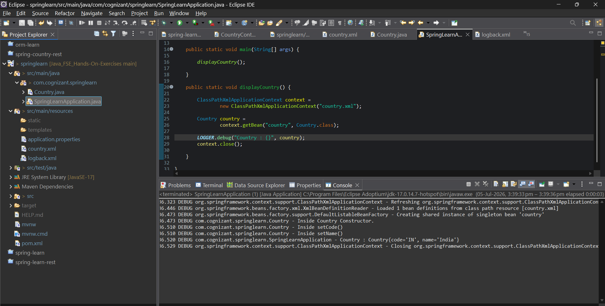

# Spring Core – Load Country from Spring Configuration XML

## Overview

This project demonstrates the use of the Spring Core Framework to configure and manage Java objects using an XML configuration file. The application loads a `Country` bean from the Spring configuration file (`country.xml`) using the Spring IoC container and displays the configured country details.

---

## Objective

- Configure a Spring bean using XML configuration.
- Perform setter-based dependency injection.
- Load the Spring configuration using `ApplicationContext`.
- Retrieve the bean using `getBean()`.
- Display the configured country details.
- Understand the working of the Spring IoC Container.

---

## Technologies Used

- Java 17
- Spring Boot 3.x
- Spring Core
- Maven
- Eclipse IDE
- SLF4J Logging

---

## Project Structure

```text
springlearn
│
├── src
│   ├── main
│   │   ├── java
│   │   │
│   │   └── com
│   │       └── cognizant
│   │           └── springlearn
│   │               ├── Country.java
│   │               └── SpringLearnApplication.java
│   │
│   └── resources
│   │       ├── application.properties
│   │       └── country.xml
│   │
│   └── test
│
└── pom.xml
```

---

## Spring Bean Configuration

The `Country` bean is configured in `country.xml`.

| Property | Value |
|----------|-------|
| Code | IN |
| Name | India |

---

## Application Components

### Country.java

The `Country` class contains:

- Instance variables (`code`, `name`)
- Default constructor
- Getter and Setter methods
- `toString()` method
- SLF4J debug logging

---

### SpringLearnApplication.java

The application:

- Loads the Spring XML configuration file.
- Creates the Spring IoC Container.
- Retrieves the `Country` bean.
- Displays the configured country details.

---

## Running the Application

### Clone the Repository

```bash
git clone <repository-url>
```

### Navigate to the Project

```bash
cd springlearn
```

### Run the Application

Run

```text
SpringLearnApplication.java
```

as a **Java Application** from Eclipse.

---

## Bean Loading Process

```text
Application Starts
        │
        ▼
Load country.xml
        │
        ▼
Create Spring IoC Container
        │
        ▼
Instantiate Country Bean
        │
        ▼
Inject Property Values
        │
        ▼
Retrieve Bean using getBean()
        │
        ▼
Display Country Details
```

---

## Sample Output

```text
Country : Country{code='IN', name='India'}
```

---

## Console Logs
```
```

---
## Spring XML Elements Used

| Element | Description |
|----------|-------------|
| `<bean>` | Defines a Spring-managed bean. |
| `id` | Unique identifier of the bean. |
| `class` | Specifies the Java class to instantiate. |
| `<property>` | Injects values into bean properties. |
| `name` | Specifies the property name. |
| `value` | Specifies the value to inject. |

---

## Learning Outcomes

- Understanding Spring Core
- Understanding Inversion of Control (IoC)
- XML-based Bean Configuration
- Setter-based Dependency Injection
- Working with `ApplicationContext`
- Using `ClassPathXmlApplicationContext`
- Retrieving beans using `getBean()`
- Understanding the Spring Bean Lifecycle

---

## Conclusion

This project demonstrates how Spring Core uses XML configuration to create and manage Java objects. The `Country` bean is configured in `country.xml`, instantiated automatically by the Spring IoC container, and retrieved using `ApplicationContext`. This exercise provides a practical understanding of Spring's IoC container, dependency injection, and XML-based bean configuration.

---