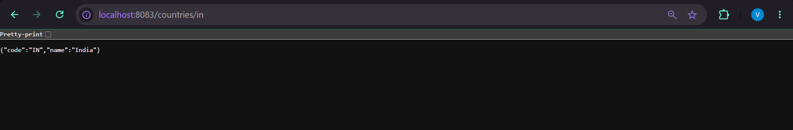
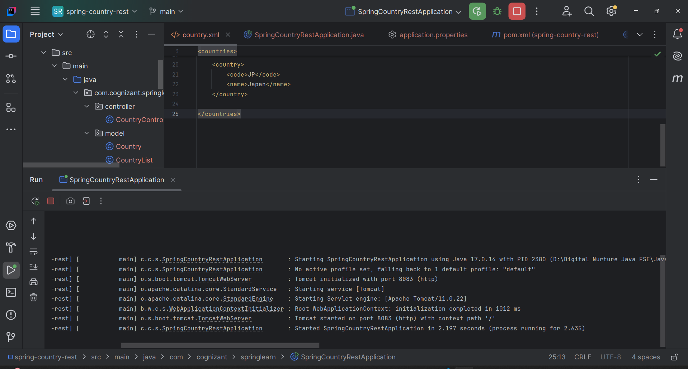

# REST - Get Country Based on Country Code

## Overview

This project demonstrates how to build a RESTful Web Service using Spring Boot that returns country details based on a given country code. The service reads country information from an XML file using JAXB and returns the matching country in JSON format. The country code lookup is case-insensitive.

---

## Objective

- Develop a REST API using Spring Boot.
- Read country data from an XML file.
- Implement a service layer to fetch country details.
- Perform case-insensitive country code matching.
- Return the response in JSON format.
- Test the API using Browser and Postman.

---

## Technologies Used

- Java 17
- Spring Boot 4.1.0
- Spring Web
- Maven
- JAXB (Jakarta XML Binding)
- Eclipse IDE
- Apache Tomcat
- SLF4J Logging

---

## Project Structure

```text
spring-country-rest
│
├── src
│   ├── main
│   │   ├── java
│   │   │   └── com.cognizant.springlearn
│   │   │       ├── SpringCountryRestApplication.java
│   │   │       ├── controller
│   │   │       │   └── CountryController.java
│   │   │       ├── model
│   │   │       │   ├── Country.java
│   │   │       │   └── CountryList.java
│   │   │       ├── service
│   │   │       │   └── CountryService.java
│   │   │       └── util
│   │   │           └── CountryUtil.java
│   │   │
│   │   └── resources
│   │       ├── application.properties
│   │       └── country.xml
│
└── pom.xml
```

---

## REST API

| Method | Endpoint | Description |
|--------|----------|-------------|
| GET | `/countries/{code}` | Returns the country details for the given country code |

---

## Sample Request

```
GET http://localhost:8083/countries/in
```

---

## Sample Response

```json
{
    "code": "IN",
    "name": "India"
}
```

---

## Features

- RESTful API using Spring Boot
- XML-based data source
- JAXB XML parsing
- Case-insensitive country lookup
- Layered Architecture
- JSON response generation
- Maven project structure

---

## Running the Project

1. Clone the repository.

```bash
git clone <repository-url>
```

2. Open the project in Eclipse.

3. Update Maven dependencies.

```
Right Click Project
→ Maven
→ Update Project
```

4. Run

```
SpringCountryRestApplication.java
```

5. Open Browser or Postman.

```
GET http://localhost:8083/countries/in
```

---

# Screenshots

## Project Structure

> Add screenshot here

```
screenshots/project-structure.png
```

---

## Running Spring Boot Application

```
## Browser Output```
```

```
## Console Logs
```
```

---

## Learning Outcomes

- Spring Boot REST API Development
- REST Controller Implementation
- Service Layer Design
- XML Parsing using JAXB
- Path Variables in Spring Boot
- Case-Insensitive Search using Java Streams
- Returning Java Objects as JSON


