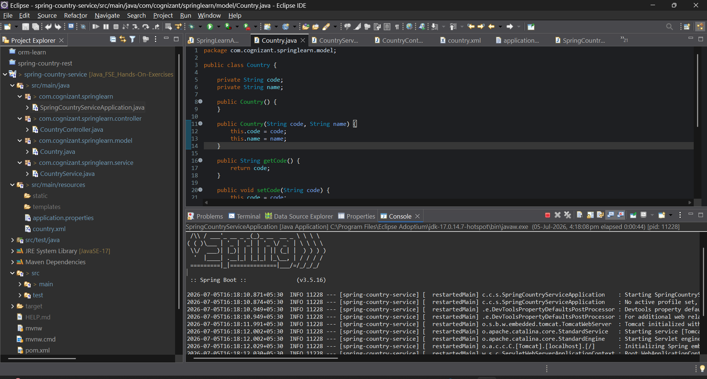
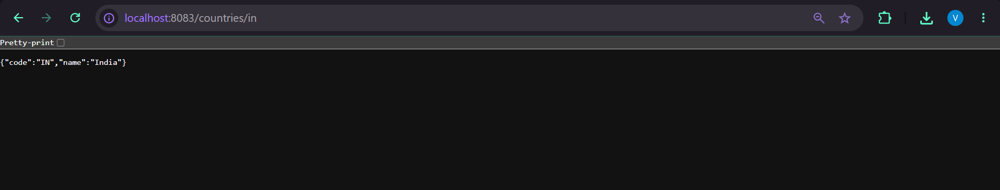

# REST - Get Country Based on Country Code

## Overview

This project demonstrates the implementation of a RESTful Web Service using **Spring Boot** that returns the details of a country based on its country code. The country information is loaded from an XML configuration file (`country.xml`), and the country code lookup is performed in a **case-insensitive** manner.

---

## Objective

- Create a RESTful Web Service using Spring Boot.
- Load country details from a Spring XML configuration file.
- Retrieve country information based on the country code.
- Perform case-insensitive country code matching.
- Return the country details as a JSON response.

---

## Technologies Used

- Java 17
- Spring Boot 3.5.x
- Spring Web
- Spring Core
- Maven
- Eclipse IDE
- Apache Tomcat (Embedded)

---

## Project Structure

```text
spring-country-service
│
├── src
│   ├── main
│   │   ├── java
│   │   │
│   │   └── com
│   │       └── cognizant
│   │           └── springlearn
│   │               ├── SpringCountryServiceApplication.java
│   │               │
│   │               ├── controller
│   │               │      └── CountryController.java
│   │               │
│   │               ├── model
│   │               │      └── Country.java
│   │               │
│   │               └── service
│   │                      └── CountryService.java
│   │
│   └── resources
│   │       ├── application.properties
│   │       └── country.xml
│   │
│   └── test
│
└── pom.xml
```

---

## REST Endpoint

| Method | Endpoint | Description |
|---------|----------|-------------|
| GET | `/countries/{code}` | Returns the country details for the given country code. |

---

## Country Data

The following countries are configured in `country.xml`:

| Code | Country |
|------|---------|
| IN | India |
| US | United States |
| DE | Germany |
| JP | Japan |

---

## Application Components

### Country.java

Represents the Country model containing:

- Country Code
- Country Name
- Getters and Setters
- Constructors
- `toString()` method

---

### CountryService.java

Responsible for:

- Loading the country list from `country.xml`
- Searching for the requested country
- Performing **case-insensitive** country code matching
- Returning the matching `Country` object

---

### CountryController.java

Exposes the REST endpoint:

```text
GET /countries/{code}
```

It invokes the service layer and returns the matching country as a JSON response.

---

## Configuration

### application.properties

```properties
server.port=8083
```

---

## Running the Application

### Clone the Repository

```bash
git clone <repository-url>
```

### Navigate to the Project

```bash
cd spring-country-service
```

### Run the Application

Run

```text
SpringCountryServiceApplication.java
```

as a **Spring Boot App** from Eclipse.

---

## Testing the API

### Browser

```text
http://localhost:8083/countries/in
```

### Postman

**Method**

```text
GET
```

**URL**

```text
http://localhost:8083/countries/in
```

---

## Sample Response

```json
{
    "code": "IN",
    "name": "India"
}
```

---

## Application Flow

```text
Client Request
       │
       ▼
CountryController
       │
       ▼
CountryService
       │
       ▼
Load Country List from country.xml
       │
       ▼
Case-Insensitive Search
       │
       ▼
Return Matching Country
       │
       ▼
Spring Boot Converts Object to JSON
       │
       ▼
Client Response
```

---

## Screenshots

### Console Output



---

### Browser Output



---

## Learning Outcomes

- Creating RESTful APIs using Spring Boot
- Using `@RestController`
- Mapping HTTP requests using `@GetMapping`
- Using `@PathVariable`
- Implementing a Service Layer
- Loading Spring Beans from an XML configuration
- Case-insensitive data retrieval
- Returning Java objects as JSON responses
- Understanding Spring Boot request handling

---

## Conclusion

This project demonstrates how to build a RESTful web service using Spring Boot that retrieves country information based on a country code. The application loads country data from a Spring XML configuration file, performs a case-insensitive search, and returns the matching country as a JSON response. It provides a practical understanding of Spring Boot REST APIs, XML-based configuration, service-layer architecture, and JSON serialization.

---