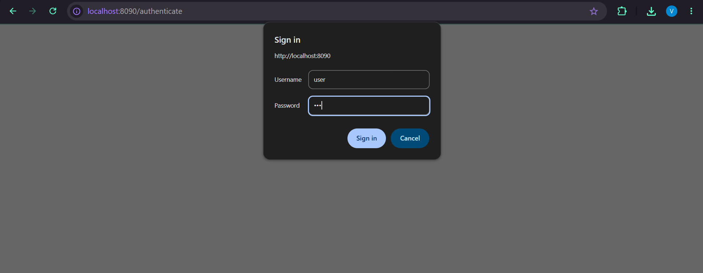
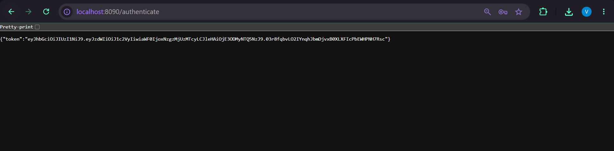

# JWT Authentication Service using Spring Boot

## Overview

This project demonstrates the implementation of a JWT (JSON Web Token) Authentication Service using Spring Boot and Spring Security. The application authenticates users using HTTP Basic Authentication, reads and decodes the `Authorization` header, generates a JWT token for the authenticated user, and returns it as a JSON response.

---

## Objective

- Configure Spring Security with HTTP Basic Authentication.
- Authenticate users using username and password.
- Read and decode the `Authorization` header.
- Generate a JWT token for authenticated users.
- Return the generated JWT as a JSON response.
- Understand the authentication flow in Spring Security.

---

## Technologies Used

- Java 17
- Spring Boot 3.5.x
- Spring Web
- Spring Security
- JJWT (Java JWT)
- Maven
- Eclipse IDE

---

## Project Structure

```text
spring-jwt-authentication
│
├── src
│   ├── main
│   │   ├── java
│   │   │
│   │   └── com
│   │       └── cognizant
│   │           └── jwtauthentication
│   │               ├── SpringJwtAuthenticationApplication.java
│   │               │
│   │               ├── config
│   │               │      └── SecurityConfig.java
│   │               │
│   │               ├── controller
│   │               │      └── AuthenticationController.java
│   │               │
│   │               ├── model
│   │               │      └── AuthenticationResponse.java
│   │               │
│   │               └── util
│   │                      └── JwtUtil.java
│   │
│   └── resources
│   │       └── application.properties
│   │
│   └── test
│
└── pom.xml
```

---

## Authentication Endpoint

| Method | Endpoint | Description |
|---------|----------|-------------|
| GET | `/authenticate` | Authenticates the user and returns a JWT token. |

---

## Application Components

### SecurityConfig.java

Configures Spring Security by:

- Creating an in-memory user.
- Enabling HTTP Basic Authentication.
- Disabling CSRF protection.
- Securing all incoming requests.

---

### AuthenticationController.java

The controller:

- Reads the `Authorization` header.
- Decodes the Base64 encoded credentials.
- Extracts the username.
- Generates a JWT token.
- Returns the token as a JSON response.

---

### JwtUtil.java

Responsible for:

- Creating JWT tokens.
- Setting the token subject.
- Setting issue and expiration times.
- Signing the token using the HS256 algorithm.

---

### AuthenticationResponse.java

Represents the JSON response containing the generated JWT token.

---

## Configuration

### application.properties

```properties
server.port=8090
```

---

## Running the Application

### Clone the Repository

```bash
git clone <repository-url>
```

### Navigate to the Project

```bash
cd spring-jwt-authentication
```

### Run the Application

Run

```text
SpringJwtAuthenticationApplication.java
```

as a **Spring Boot App** from Eclipse.

---

## Authentication Flow

```text
Client Request
        │
        ▼
HTTP Basic Authentication
        │
        ▼
Spring Security Validates User
        │
        ▼
AuthenticationController
        │
        ▼
Read Authorization Header
        │
        ▼
Decode Username & Password
        │
        ▼
Generate JWT Token
        │
        ▼
Return JSON Response
```

---

## Testing the API

### Browser

```text
http://localhost:8090/authenticate
```

A login dialog will appear.

Enter:

```text
Username : user
Password : pwd
```

---

### cURL

```bash
curl -s -u user:pwd http://localhost:8090/authenticate
```

---

## Sample Response

```json
{
    "token": "eyJhbGciOiJIUzI1NiJ9..."
}
```

---

## Screenshots

### Authentication Prompt



---

### JWT Token Response



---

## Spring Security Components Used

| Component | Description |
|-----------|-------------|
| `SecurityFilterChain` | Configures HTTP security for the application. |
| `InMemoryUserDetailsManager` | Stores user credentials in memory. |
| `UserDetails` | Represents authenticated user information. |
| `@RestController` | Creates REST endpoints. |
| `@GetMapping` | Maps HTTP GET requests. |
| `@RequestHeader` | Reads the Authorization header. |
| `Base64` | Decodes Basic Authentication credentials. |

---

## Learning Outcomes

- Understanding JWT Authentication
- Configuring Spring Security
- Implementing HTTP Basic Authentication
- Reading HTTP Request Headers
- Decoding Base64 Encoded Credentials
- Generating JWT Tokens
- Returning JSON Responses
- Building Secure REST APIs

---

## Conclusion

This project demonstrates how to build a JWT Authentication Service using Spring Boot and Spring Security. The application authenticates users through HTTP Basic Authentication, decodes the received credentials, generates a JWT token, and returns it in a JSON response. This exercise provides a practical understanding of authentication mechanisms, Spring Security configuration, and JWT-based token generation for securing RESTful web services.

---