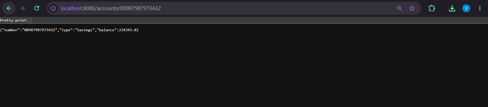
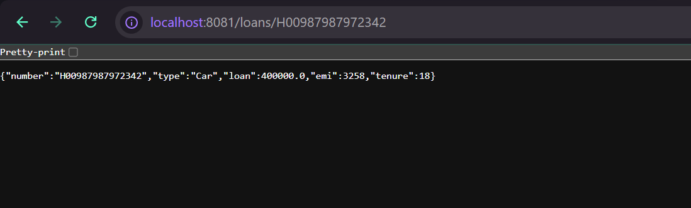

# Creating Microservices for Account and Loan

## Overview

This project demonstrates the fundamentals of the Microservices architecture by creating two independent Spring Boot RESTful web services for a banking application:

- **Account Microservice** – Provides account details based on the account number.
- **Loan Microservice** – Provides loan details based on the loan account number.

Each microservice is implemented as a separate Spring Boot Maven project with its own `pom.xml`, runs independently, and exposes its own REST API. Since both services cannot run on the default port simultaneously, the Loan Microservice is configured to use a different port.

---

## Objective

- Create two independent Spring Boot microservices.
- Develop a REST API for Account details.
- Develop a REST API for Loan details.
- Configure different server ports for each microservice.
- Test both microservices independently using a web browser.

---

## Technologies Used

- Java 17
- Spring Boot 3.5.x
- Spring Web
- Maven
- Eclipse IDE
- Apache Tomcat (Embedded)

---

# Microservice 1: Account Service

## Project Structure

```text
account
│
├── src
│   ├── main
│   │   ├── java
│   │   │
│   │   └── com
│   │       └── cognizant
│   │           └── account
│   │               ├── AccountApplication.java
│   │               ├── controller
│   │               │      └── AccountController.java
│   │               └── model
│   │                      └── Account.java
│   │
│   └── resources
│          └── application.properties
│
└── pom.xml
```

---

## REST Endpoint

| Method | Endpoint | Description |
|---------|----------|-------------|
| GET | `/accounts/{number}` | Returns the account details for the given account number. |

---

## Sample Response

```json
{
    "number": "00987987973432",
    "type": "Savings",
    "balance": 234343.0
}
```

---

## Configuration

```properties
server.port=8080
```

---

# Microservice 2: Loan Service

## Project Structure

```text
loan
│
├── src
│   ├── main
│   │   ├── java
│   │   │
│   │   └── com
│   │       └── cognizant
│   │           └── loan
│   │               ├── LoanApplication.java
│   │               ├── controller
│   │               │      └── LoanController.java
│   │               └── model
│   │                      └── Loan.java
│   │
│   └── resources
│          └── application.properties
│
└── pom.xml
```

---

## REST Endpoint

| Method | Endpoint | Description |
|---------|----------|-------------|
| GET | `/loans/{number}` | Returns the loan details for the given loan account number. |

---

## Sample Response

```json
{
    "number": "H00987987972342",
    "type": "Car",
    "loan": 400000.0,
    "emi": 3258,
    "tenure": 18
}
```

---

## Configuration

```properties
server.port=8081
```

---

# Running the Applications

## Clone the Repository

```bash
git clone <repository-url>
```

---

## Navigate to the Account Microservice

```bash
cd account
```

Run

```text
AccountApplication.java
```

as a **Spring Boot App**.

---

## Navigate to the Loan Microservice

```bash
cd loan
```

Run

```text
LoanApplication.java
```

as a **Spring Boot App**.

---

## Testing the APIs

### Account Service

**URL**

```text
http://localhost:8080/accounts/00987987973432
```

---

### Loan Service

**URL**

```text
http://localhost:8081/loans/H00987987972342
```

---

## Microservices Architecture

```text
                  Client
                     │
        ┌────────────┴────────────┐
        │                         │
        ▼                         ▼
 Account Microservice      Loan Microservice
      Port 8080               Port 8081
        │                         │
        ▼                         ▼
 Returns Account Data     Returns Loan Data
```

---

## Screenshots

### Account Service Response



---

### Loan Service Response



---

## Learning Outcomes

- Understanding Microservices Architecture
- Creating Independent Spring Boot Applications
- Developing RESTful Web Services
- Using `@RestController`
- Mapping HTTP Requests with `@GetMapping`
- Passing Path Variables using `@PathVariable`
- Running Multiple Spring Boot Applications
- Configuring Different Server Ports
- Testing REST APIs using a Web Browser

---

## Conclusion

This project demonstrates the creation of two independent Spring Boot microservices for a banking application. The **Account Microservice** and **Loan Microservice** are developed as separate applications, each exposing its own REST endpoint and running on different ports. This exercise provides a practical introduction to microservices architecture, RESTful web services, and multi-service application deployment using Spring Boot.

---