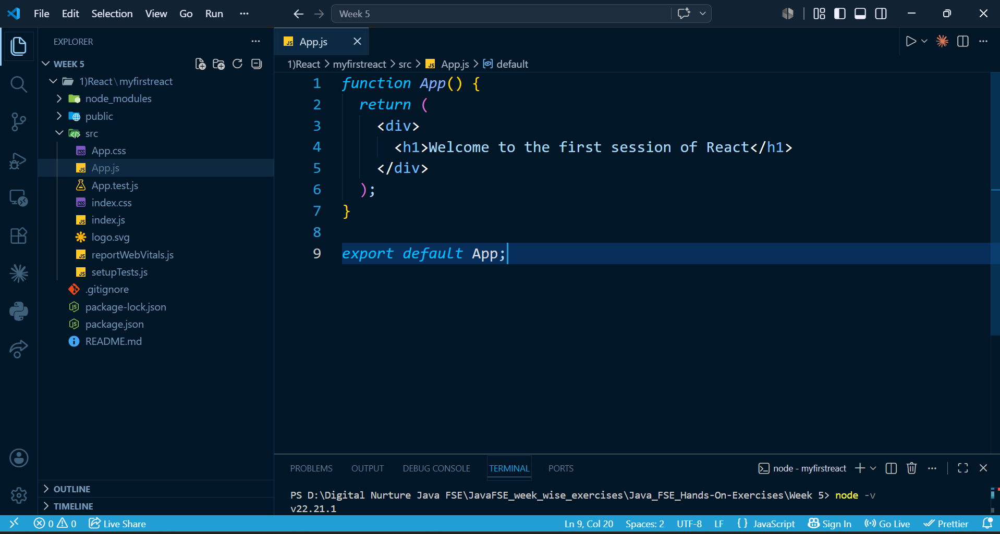
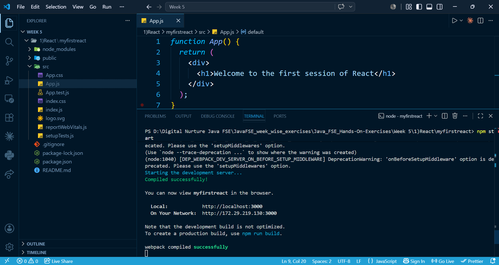
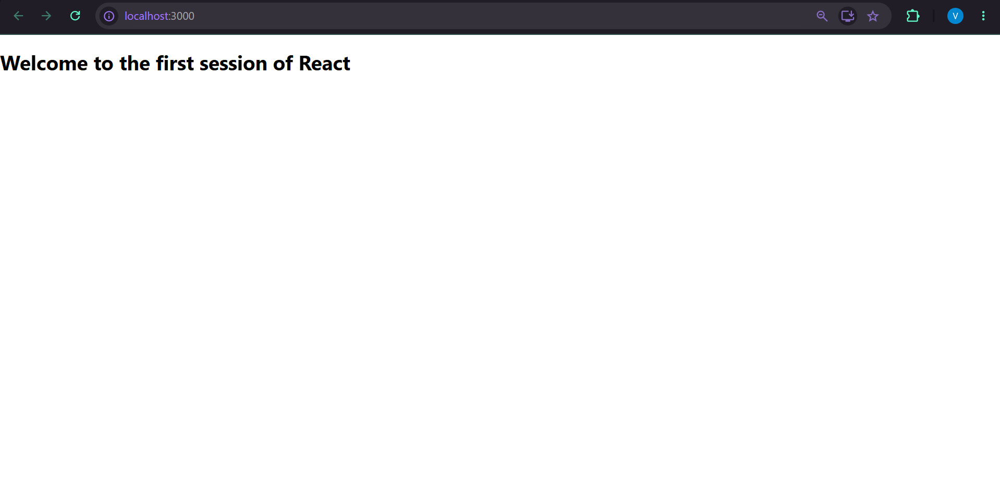

# React Hands-on Lab 1 – Creating Your First React Application

## Overview

This project demonstrates the creation of a basic React application using **Create React App**. The application displays a simple heading on the webpage:

> **Welcome to the first session of React**

This exercise introduces the fundamentals of setting up a React development environment and running a React application.

---

## Objectives

* Understand the concept of Single-Page Applications (SPA).
* Learn the basics of React.
* Set up a React development environment.
* Create a React application using Create React App.
* Run a React application successfully.
* Display a simple heading using a React component.

---

## Prerequisites

Before running this project, ensure the following are installed:

* Node.js
* npm (comes with Node.js)
* Visual Studio Code

---

## Technologies Used

* React
* JavaScript (ES6)
* HTML
* CSS
* Node.js
* npm
* Create React App

---

## Project Structure

```text
myfirstreact/
│
├── public/
├── src/
│   ├── App.js
│   ├── index.js
│   ├── App.css
│   └── ...
├── package.json
└── README.md
```

---

## Implementation

The default contents of `App.js` were replaced with a simple React functional component that renders the following heading:

```jsx
function App() {
  return (
    <div>
      <h1>Welcome to the first session of React</h1>
    </div>
  );
}

export default App;
```

---

## How to Run the Project

### 1. Clone the repository

```bash
git clone <repository-url>
```

### 2. Navigate to the project directory

```bash
cd myfirstreact
```

### 3. Install dependencies

```bash
npm install
```

### 4. Start the development server

```bash
npm start
```

### 5. Open the application

Visit the following URL in your browser:

```text
http://localhost:3000
```

---

## Expected Output

The browser displays the following heading:

```text
Welcome to the first session of React
```

---

## Learning Outcomes

After completing this exercise, you will be able to:

* Create a React application using Create React App.
* Understand the basic structure of a React project.
* Edit and render a React component.
* Run a React application using the development server.
* Verify the application in a web browser.

---

## Screenshots

Include the following screenshots in this section:


 


---

## Conclusion

This hands-on exercise provided an introduction to React by creating and running a simple application using Create React App. It established the development environment and demonstrated how React components can be used to render content on a webpage, laying the foundation for building more advanced React applications.
