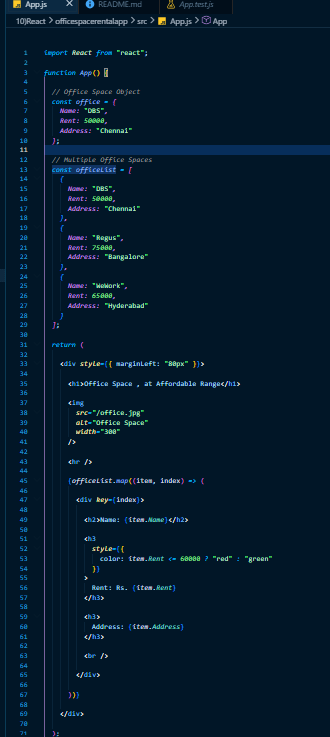
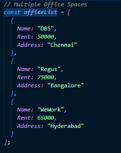
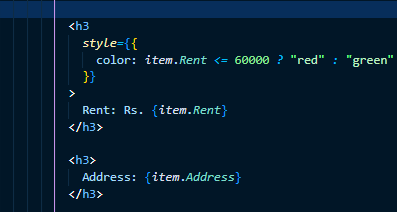
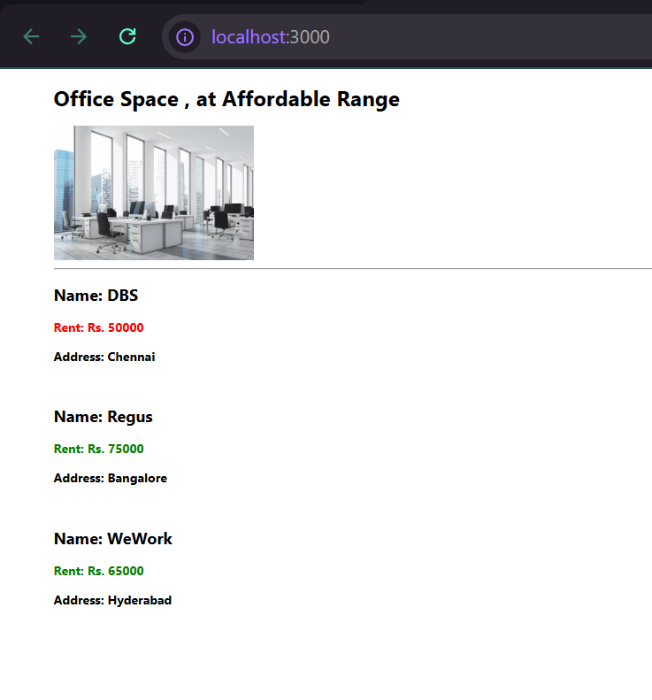

# React Hands-on Lab 7 – Building a React Application using JSX

## Overview

This project demonstrates the fundamentals of **JSX (JavaScript XML)** in React by creating a simple Office Space Rental application. The application showcases how JSX simplifies the creation of React elements, embeds JavaScript expressions within HTML-like syntax, and applies inline CSS for dynamic styling.

The application displays office space details such as **Name**, **Rent**, and **Address**, while dynamically changing the rent color based on its value.

---

## Objectives

- Understand JSX syntax in React.
- Learn how JSX simplifies creating React elements.
- Use JavaScript expressions inside JSX.
- Apply JSX attributes.
- Render React elements to the DOM.
- Apply Inline CSS in JSX.
- Display data using JavaScript objects and arrays.
- Implement conditional styling using JavaScript expressions.

---

## Prerequisites

Before running this project, ensure the following are installed:

- Node.js
- npm
- Visual Studio Code

---

## Technologies Used

- React
- JavaScript (ES6)
- JSX
- HTML
- CSS
- Node.js
- npm
- Create React App

---

## Project Structure

```text
officespacerentalapp/
│
├── public/
│   └── office.jpg
│
├── src/
│   ├── App.js
│   ├── index.js
│   └── ...
│
├── package.json
└── README.md
```

---

## Application Features

- Displays a heading using JSX.
- Displays an office space image using JSX attributes.
- Creates an Office object containing:
  - Name
  - Rent
  - Address
- Stores multiple office spaces in an array.
- Uses the **map()** method to render multiple office listings.
- Uses JavaScript expressions within JSX to display office details.
- Applies **Inline CSS** to dynamically color the rent value:
  - **Red** for rent less than or equal to ₹60,000.
  - **Green** for rent greater than ₹60,000.

---

# JSX Concepts Demonstrated

## 1. JSX Elements

Creates HTML-like elements directly inside JavaScript.

Example:

```jsx
<h1>Office Space, at Affordable Range</h1>
```

---

## 2. JSX Attributes

Uses JSX attributes to display an image.

Example:

```jsx

```

---

## 3. JavaScript Expressions in JSX

Displays dynamic values using curly braces.

Example:

```jsx
<h2>Name: {item.Name}</h2>
<h3>Rent: Rs. {item.Rent}</h3>
<h3>Address: {item.Address}</h3>
```

---

## 4. Rendering Lists using map()

Uses the ES6 `map()` method to render multiple office spaces.

Example:

```javascript
officeList.map((item) => (
    <div>
        ...
    </div>
))
```

---

## 5. Inline CSS

Applies dynamic styling directly within JSX.

Example:

```jsx
style={{
    color: item.Rent <= 60000 ? "red" : "green"
}}
```

---

## 6. Conditional Styling

Changes the rent color depending on the rental price.

- Rent ≤ ₹60,000 → **Red**
- Rent > ₹60,000 → **Green**

This improves the visual representation of office rental prices.

---

## How to Run the Project

### 1. Clone the repository

```bash
git clone <repository-url>
```

### 2. Navigate to the project directory

```bash
cd officespacerentalapp
```

### 3. Install dependencies

```bash
npm install
```

### 4. Start the development server

```bash
npm start
```

### 5. Open the application

Visit:

```text
http://localhost:3000
```

---

## Expected Output

The application displays:

- A heading titled **Office Space, at Affordable Range**
- An office space image
- Multiple office listings

Each office listing contains:

- Office Name
- Rent
- Address

### Rent Color

- **Red** if Rent ≤ ₹60,000
- **Green** if Rent > ₹60,000

Example:

```text
Office Space, at Affordable Range

[Office Image]

Name: DBS

Rent: Rs. 50000     (Red)

Address: Chennai

----------------------------

Name: Regus

Rent: Rs. 75000     (Green)

Address: Bangalore

----------------------------

Name: WeWork

Rent: Rs. 65000     (Green)

Address: Hyderabad
```

---

## Learning Outcomes

After completing this exercise, you will be able to:

- Understand the fundamentals of JSX.
- Create React elements using JSX syntax.
- Render JSX elements to the DOM.
- Use JavaScript expressions inside JSX.
- Display data from JavaScript objects and arrays.
- Render collections using the `map()` method.
- Apply Inline CSS in React.
- Implement conditional styling using JavaScript expressions.
- Build simple, dynamic React applications using JSX.

---

## Screenshots

### App Component



---

### Office Data Object



---

### JSX with Inline Styling



---

### Application Output



---

## Conclusion

This hands-on exercise introduced the core concepts of **JSX** in React by building a simple Office Space Rental application. Through the use of **JSX elements, JavaScript expressions, object rendering, list rendering with `map()`, and inline CSS**, the application demonstrates how React combines JavaScript and HTML-like syntax to create dynamic and interactive user interfaces. These concepts serve as the foundation for developing modern React applications.