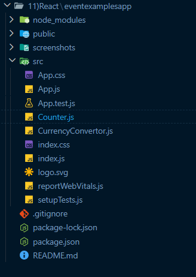
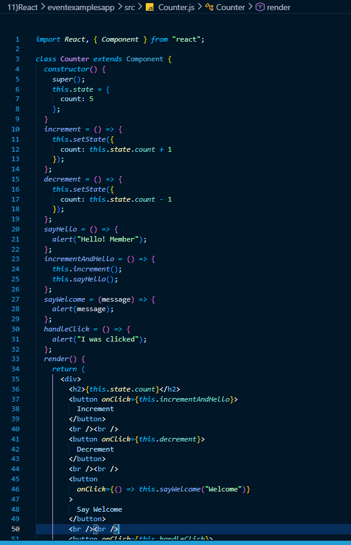
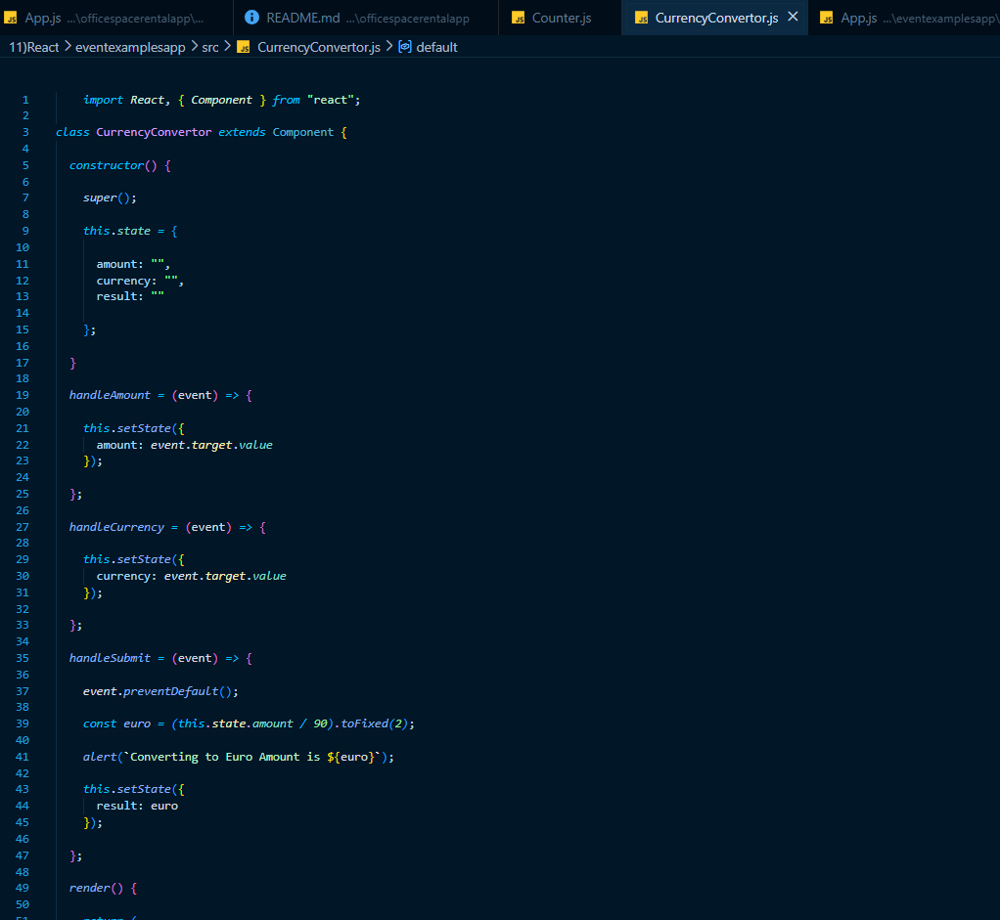
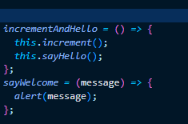
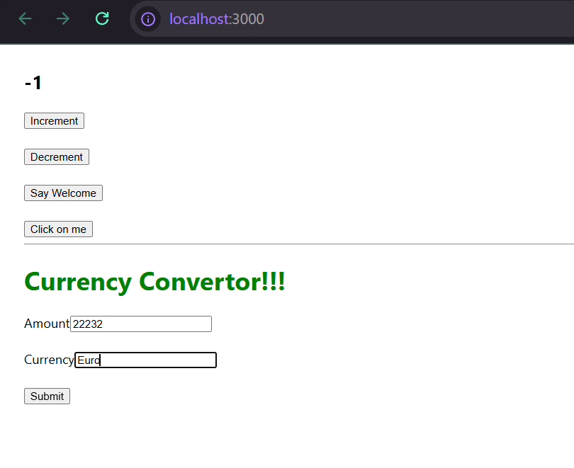

# React Hands-on Lab 8 – Event Handling in React

## Overview

This project demonstrates the implementation of **Event Handling** in React using class components. The application showcases various event-handling techniques, including handling button clicks, invoking multiple methods on a single event, passing arguments to event handlers, working with React Synthetic Events, and handling form submissions through a simple Currency Converter.

The project consists of two components:

- **Counter** – Demonstrates button click events, state updates, passing arguments, and synthetic events.
- **CurrencyConvertor** – Demonstrates form handling, user input, and currency conversion using event handlers.

---

## Objectives

- Understand React Event Handling.
- Learn about Event Handlers.
- Understand React Synthetic Events.
- Learn React event naming conventions.
- Invoke multiple methods using a single event.
- Pass arguments to event handlers.
- Handle form submission events.
- Update component state using event handlers.

---

## Prerequisites

Before running this project, ensure the following are installed:

- Node.js
- npm
- Visual Studio Code

---

## Technologies Used

- React
- JavaScript (ES6)
- JSX
- React Class Components
- React State
- Event Handling
- HTML
- CSS
- Node.js
- npm
- Create React App

---

## Project Structure

```text
eventexamplesapp/
│
├── public/
│
├── src/
│   ├── App.js
│   ├── Counter.js
│   ├── CurrencyConvertor.js
│   ├── index.js
│   └── ...
│
├── package.json
└── README.md
```

---

## Application Features

### Counter Component

- Displays a counter initialized with a default value.
- Provides an **Increment** button to increase the counter.
- Provides a **Decrement** button to decrease the counter.
- Invokes multiple methods when the **Increment** button is clicked.
- Displays a welcome message using a button that passes arguments.
- Demonstrates React Synthetic Events using a button click.

### Currency Convertor Component

- Accepts the amount in Indian Rupees.
- Accepts the target currency.
- Converts the amount from INR to Euro.
- Displays the converted amount through an alert.
- Handles form submission using the `onSubmit` event.

---

# Event Handling Concepts Demonstrated

## 1. Button Click Events

Handles button click events using the `onClick` attribute.

Example:

```jsx
<button onClick={this.increment}>
    Increment
</button>
```

---

## 2. Multiple Method Invocation

The **Increment** button invokes two methods:

- Increment the counter.
- Display a greeting message.

Example:

```javascript
incrementAndHello = () => {
    this.increment();
    this.sayHello();
};
```

---

## 3. Passing Arguments to Event Handlers

Passes a custom argument to an event handler using an arrow function.

Example:

```jsx
<button
    onClick={() => this.sayWelcome("Welcome")}
>
    Say Welcome
</button>
```

---

## 4. Synthetic Events

Demonstrates React's Synthetic Event system.

Example:

```jsx
<button onClick={this.handleClick}>
    Click on me
</button>
```

Displays:

```text
I was clicked
```

---

## 5. State Management

Updates the counter using React state.

Example:

```javascript
this.setState({
    count: this.state.count + 1
});
```

---

## 6. Form Handling

Uses controlled form elements and the `onSubmit` event.

Example:

```jsx
<form onSubmit={this.handleSubmit}>
```

The `handleSubmit()` method performs the currency conversion.

---

## 7. Prevent Default Form Submission

Prevents the browser from refreshing after form submission.

Example:

```javascript
event.preventDefault();
```

---

## How to Run the Project

### 1. Clone the repository

```bash
git clone <repository-url>
```

### 2. Navigate to the project directory

```bash
cd eventexamplesapp
```

### 3. Install dependencies

```bash
npm install
```

### 4. Start the development server

```bash
npm start
```

### 5. Open the application

Visit:

```text
http://localhost:3000
```

---

## Expected Output

### Counter Section

The application displays:

- Current counter value
- Increment button
- Decrement button
- Say Welcome button
- Click on me button

Example:

```text
5

[Increment]

[Decrement]

[Say Welcome]

[Click on me]
```

---

### Increment Button

On clicking **Increment**:

- Counter increases by **1**
- Displays

```text
Hello! Member
```

---

### Decrement Button

On clicking **Decrement**:

```text
Counter decreases by 1.
```

---

### Say Welcome Button

Displays:

```text
Welcome
```

---

### Click on me Button

Displays:

```text
I was clicked
```

---

### Currency Convertor

Input:

```text
Amount : 90

Currency : Euro
```

Click **Submit**

Displays:

```text
Converting to Euro Amount is 1.00
```

---

## Learning Outcomes

After completing this exercise, you will be able to:

- Handle events in React applications.
- Understand React Event Handlers.
- Work with React Synthetic Events.
- Update component state using events.
- Invoke multiple methods using a single event.
- Pass parameters to event handlers.
- Handle form submissions.
- Prevent default browser behavior.
- Build interactive React applications using event-driven programming.

---

## Screenshots

### Project Structure



---

### Counter Component



---

### CurrencyConvertor Component



---

### Multiple Event Handling



---

### Application Output



---

## Conclusion

This hands-on exercise demonstrated the implementation of **React Event Handling** using class components. It covered button click events, multiple method invocation, passing arguments to event handlers, React Synthetic Events, state updates, controlled form components, and form submission handling. These concepts are fundamental for building interactive and responsive React applications that effectively respond to user actions.