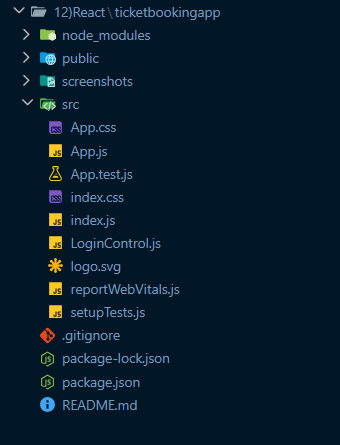
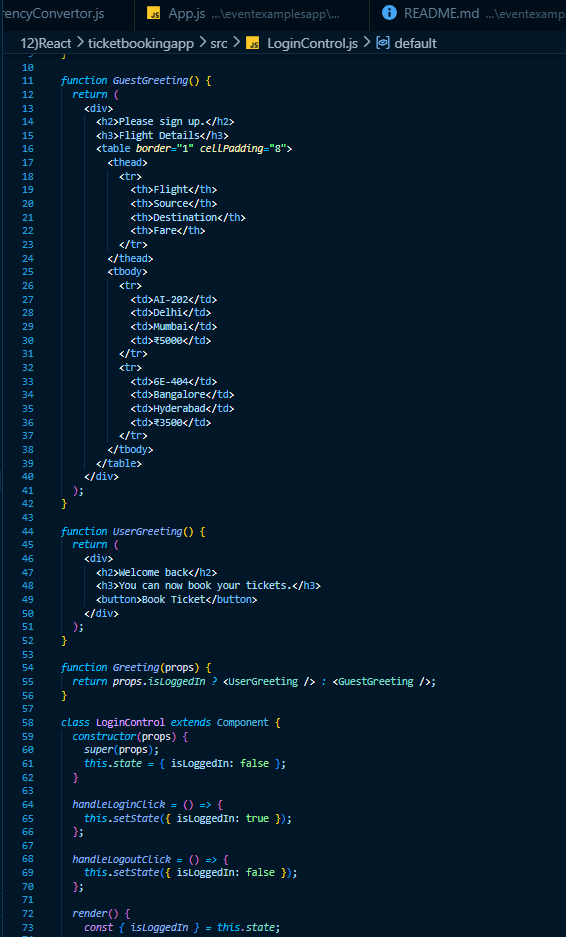
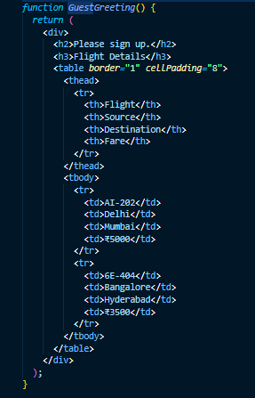
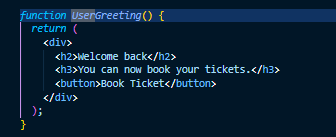
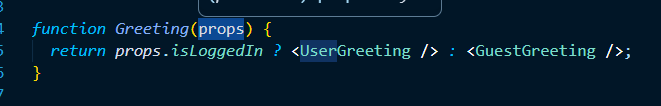

# React Hands-on Lab 9 – Conditional Rendering in React

## Overview

This project demonstrates the implementation of **Conditional Rendering** in React by building a simple Ticket Booking application. The application allows guest users to browse available flight details, while logged-in users are granted access to book tickets.

The application dynamically switches between **Guest** and **User** views based on the user's login status using React state and conditional rendering techniques.

The project consists of the following components:

- **LoginButton** – Displays the Login button.
- **LogoutButton** – Displays the Logout button.
- **GuestGreeting** – Displays flight details for guest users.
- **UserGreeting** – Displays the ticket booking page for authenticated users.
- **Greeting** – Conditionally renders the appropriate component based on login status.
- **LoginControl** – Maintains the login state and controls the application flow.

---

## Objectives

- Understand Conditional Rendering in React.
- Learn about Element Variables.
- Render different components based on application state.
- Prevent unnecessary components from rendering.
- Manage component state using React.
- Handle Login and Logout events.

---

## Prerequisites

Before running this project, ensure the following are installed:

- Node.js
- npm
- Visual Studio Code

---

## Technologies Used

- React
- JavaScript (ES6)
- JSX
- React State
- Conditional Rendering
- Event Handling
- HTML
- CSS
- Node.js
- npm
- Create React App

---

## Project Structure

```text
ticketbookingapp/
│
├── public/
│
├── src/
│   ├── App.js
│   ├── LoginControl.js
│   ├── index.js
│   └── ...
│
├── package.json
└── README.md
```

---

## Application Features

### Guest User

- Displays a welcome message asking the user to sign up.
- Shows available flight details.
- Displays only the **Login** button.
- Does not allow ticket booking.

### Logged-in User

- Displays a welcome message.
- Allows the user to book flight tickets.
- Displays the **Logout** button.
- Hides the guest page completely.

### Login Control

- Maintains login status using React state.
- Dynamically switches between Guest and User pages.
- Demonstrates React Conditional Rendering.

---

# React Concepts Demonstrated

## 1. Conditional Rendering

The application renders different components depending on whether the user is logged in.

Example:

```javascript
function Greeting(props) {

    if (props.isLoggedIn) {
        return <UserGreeting />;
    }

    return <GuestGreeting />;
}
```

---

## 2. Element Variables

Stores JSX elements inside variables before rendering.

Example:

```javascript
let button;

if (isLoggedIn) {
    button = <LogoutButton />;
}
else {
    button = <LoginButton />;
}
```

---

## 3. State Management

Uses component state to maintain login status.

Example:

```javascript
this.state = {
    isLoggedIn: false
};
```

---

## 4. Event Handling

Handles Login and Logout button clicks.

Example:

```javascript
<button onClick={this.handleLoginClick}>
    Login
</button>
```

---

## 5. Component Rendering

Displays either the Guest or User component based on state.

Example:

```jsx
<Greeting isLoggedIn={isLoggedIn} />
```

---

## How to Run the Project

### 1. Clone the repository

```bash
git clone <repository-url>
```

### 2. Navigate to the project directory

```bash
cd ticketbookingapp
```

### 3. Install dependencies

```bash
npm install
```

### 4. Start the development server

```bash
npm start
```

### 5. Open the application

Visit:

```text
http://localhost:3000
```

---

## Expected Output

### Guest View

Initially, the application displays:

```text
Please sign up.

Flight Details

------------------------------------------
Flight      Source      Destination   Fare
------------------------------------------
AI-202      Delhi       Mumbai        ₹5000
6E-404      Bangalore   Hyderabad     ₹3500

[Login]
```

---

### Logged-in View

After clicking **Login**, the application displays:

```text
Welcome back

You can now book your tickets.

[Book Ticket]

[Logout]
```

---

### Logout

After clicking **Logout**, the application returns to the Guest View.

---

## Learning Outcomes

After completing this exercise, you will be able to:

- Understand Conditional Rendering in React.
- Render different UI based on component state.
- Use Element Variables for rendering JSX.
- Manage application state using React.
- Handle Login and Logout events.
- Prevent components from rendering unnecessarily.
- Build interactive React applications with dynamic user interfaces.

---

## Screenshots

### Project Structure



---

### LoginControl Component



---

### GuestGreeting Component



---

### UserGreeting Component



---

### Conditional Rendering Logic



---

### Terminal Output


---

### Guest View Output


---

### Logged-in View Output


---

## Conclusion

This hands-on exercise demonstrated the implementation of **Conditional Rendering** in React using component state and element variables. By dynamically switching between Guest and User views based on the login status, the application illustrates how React efficiently renders components according to application state. These concepts are fundamental for developing real-world React applications that require authentication, role-based access, and dynamic user interfaces.