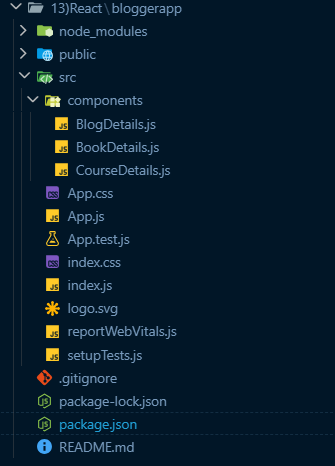
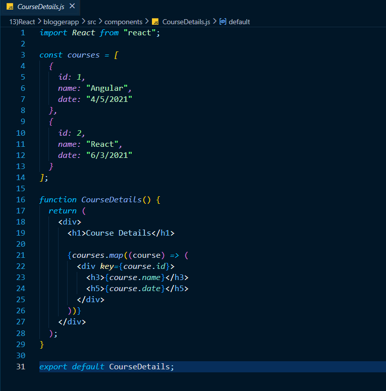
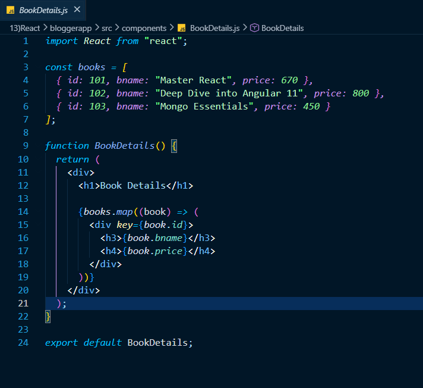
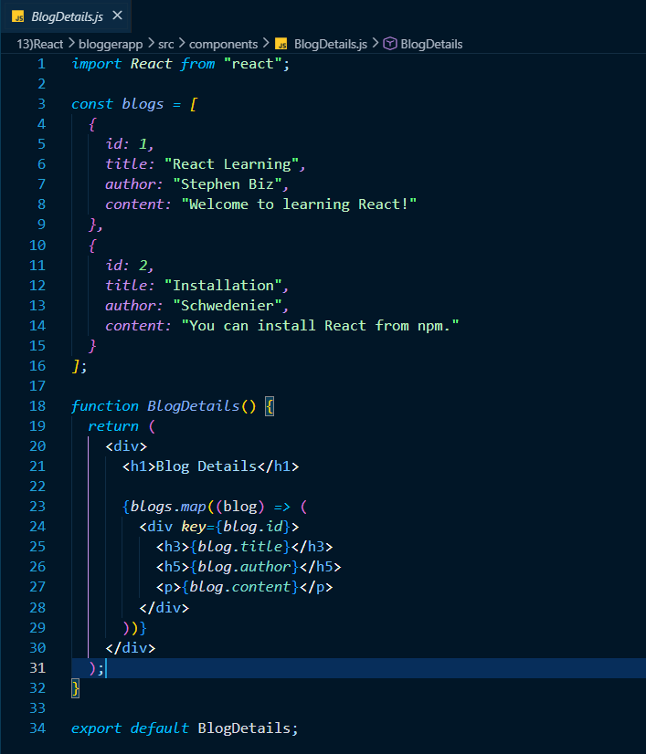
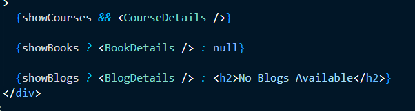
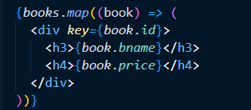
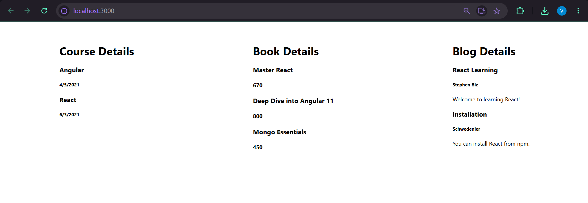

# React Hands-on Lab 10 – Rendering Multiple Components, Lists, Keys, and Conditional Rendering

## Overview

This project demonstrates how to render multiple components in React while working with **lists, keys, the `map()` function, and different approaches to conditional rendering**. The application displays information related to **Courses, Books, and Blogs** by rendering separate reusable components.

Each section displays data stored in JavaScript arrays and uses React's `map()` function to dynamically generate UI elements. The application also demonstrates multiple techniques for conditional rendering such as **Logical AND (`&&`)** and the **Ternary Operator (`? :`)**.

---

## Objectives

- Understand various ways of Conditional Rendering.
- Learn how to render multiple React components.
- Understand List Components.
- Learn the importance of Keys in React.
- Extract reusable components with Keys.
- Render collections using the `map()` function.

---

## Prerequisites

Before running this project, ensure the following are installed:

- Node.js
- npm
- Visual Studio Code

---

## Technologies Used

- React
- JavaScript (ES6)
- JSX
- Conditional Rendering
- React Components
- React Lists
- React Keys
- HTML
- CSS
- Node.js
- npm
- Create React App

---

## Project Structure

```text
bloggerapp/
│
├── public/
│
├── src/
│   ├── components/
│   │   ├── BookDetails.js
│   │   ├── BlogDetails.js
│   │   └── CourseDetails.js
│   │
│   ├── App.js
│   ├── index.js
│   └── ...
│
├── package.json
└── README.md
```

---

## Application Features

### Course Details

- Displays a list of available courses.
- Shows course name and course date.
- Uses the `map()` function to render each course.
- Assigns unique keys for every course.

### Book Details

- Displays a list of books.
- Shows book title and price.
- Renders data dynamically using `map()`.
- Uses unique keys for efficient rendering.

### Blog Details

- Displays blog information.
- Shows title, author, and content.
- Uses React lists and keys.

### Conditional Rendering

The application demonstrates multiple ways of conditional rendering:

- Logical AND (`&&`)
- Ternary Operator (`? :`)
- Conditional rendering with fallback UI

---

# React Concepts Demonstrated

## 1. Rendering Lists using map()

Uses the ES6 `map()` method to render multiple objects.

Example:

```javascript
books.map((book) => (
    <div key={book.id}>
        <h3>{book.bname}</h3>
        <h4>{book.price}</h4>
    </div>
))
```

---

## 2. React Keys

Each rendered element is assigned a unique key.

Example:

```jsx
key={book.id}
```

Using keys helps React efficiently identify and update changed elements.

---

## 3. Conditional Rendering using Logical AND

Displays a component only when the condition is true.

Example:

```jsx
{showCourses && <CourseDetails />}
```

---

## 4. Conditional Rendering using Ternary Operator

Displays one component or another based on a condition.

Example:

```jsx
{showBooks ? <BookDetails /> : null}
```

---

## 5. Conditional Rendering with Alternate UI

Displays fallback content when the condition is false.

Example:

```jsx
{showBlogs ? <BlogDetails /> : <h2>No Blogs Available</h2>}
```

---

## 6. Component Composition

The application combines multiple reusable components inside the main `App` component.

Example:

```jsx
<CourseDetails />
<BookDetails />
<BlogDetails />
```

---

## How to Run the Project

### 1. Clone the repository

```bash
git clone <repository-url>
```

### 2. Navigate to the project directory

```bash
cd bloggerapp
```

### 3. Install dependencies

```bash
npm install
```

### 4. Start the development server

```bash
npm start
```

### 5. Open the application

Visit:

```text
http://localhost:3000
```

---

## Expected Output

The application displays three sections side-by-side.

### Course Details

```text
Angular

4/5/2021

React

6/3/2021
```

---

### Book Details

```text
Master React

670

Deep Dive into Angular 11

800

Mongo Essentials

450
```

---

### Blog Details

```text
React Learning

Stephen Biz

Welcome to learning React!

Installation

Schwedenier

You can install React from npm.
```

---

## Learning Outcomes

After completing this exercise, you will be able to:

- Render multiple React components.
- Render collections using the `map()` function.
- Assign unique keys to React list items.
- Understand why keys improve rendering performance.
- Implement different techniques of Conditional Rendering.
- Build reusable and modular React components.
- Organize applications using component composition.

---

## Screenshots

### Project Structure



---
### CourseDetails Component



---

### BookDetails Component



---

### BlogDetails Component



---

### Conditional Rendering Logic



---

### List Rendering using map()



---

### Application Output



---

## Conclusion

This hands-on exercise demonstrated how to build a React application using **multiple reusable components**, **list rendering with the `map()` function**, **React Keys**, and **various approaches to conditional rendering**. By organizing data into separate components and rendering collections dynamically, the application follows React's component-based architecture and highlights essential concepts used in modern React development.