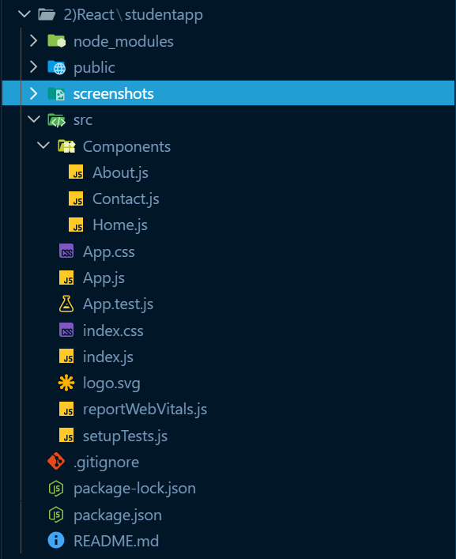
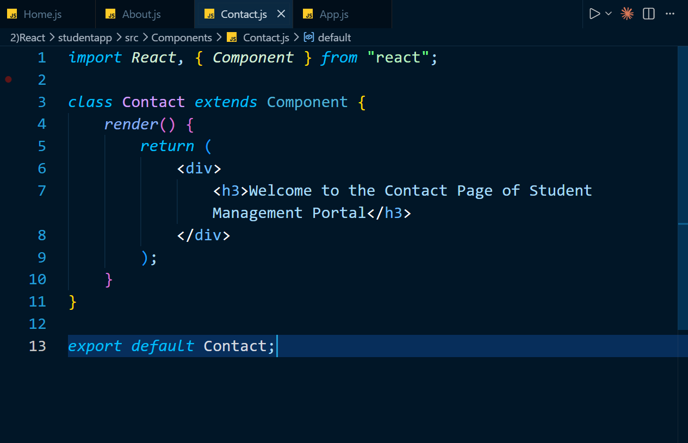

# React Hands-on Lab 2 – Creating and Rendering Multiple Class Components

## Overview

This project demonstrates the creation of multiple **React Class Components** in a Student Management Portal application. Three separate components—**Home**, **About**, and **Contact**—are created and rendered from the main `App` component to display their respective welcome messages.

This exercise introduces the concept of React components, class components, and rendering multiple components within a single application.

---

## Objectives

- Understand React Components.
- Differentiate between React Components and JavaScript functions.
- Learn the types of React components.
- Create and use Class Components.
- Understand the purpose of the `render()` method.
- Render multiple components from the main application.

---

## Prerequisites

Before running this project, ensure the following are installed:

- Node.js
- npm
- Visual Studio Code

---

## Technologies Used

- React
- JavaScript (ES6)
- JSX
- HTML
- CSS
- Node.js
- npm
- Create React App

---

## Project Structure

```text
StudentApp/
│
├── public/
├── src/
│   ├── Components/
│   │   ├── Home.js
│   │   ├── About.js
│   │   └── Contact.js
│   │
│   ├── App.js
│   ├── App.css
│   ├── index.js
│   └── ...
│
├── package.json
└── README.md
```

---

## Components Created

### Home Component

Displays the message:

```text
Welcome to the Home Page of Student Management Portal
```

---

### About Component

Displays the message:

```text
Welcome to the About Page of Student Management Portal
```

---

### Contact Component

Displays the message:

```text
Welcome to the Contact Page of Student Management Portal
```

---

## Application Flow

1. Three separate class components are created:
   - Home
   - About
   - Contact

2. Each component returns its respective welcome message using the `render()` method.

3. The `App` component imports all three components.

4. The `App` component renders all three components on the webpage.

---

## How to Run the Project

### 1. Clone the repository

```bash
git clone <repository-url>
```

### 2. Navigate to the project directory

```bash
cd StudentApp
```

### 3. Install dependencies

```bash
npm install
```

### 4. Start the development server

```bash
npm start
```

### 5. Open the application

Visit:

```text
http://localhost:3000
```

---

## Expected Output

The browser displays:

```text
Welcome to the Home Page of Student Management Portal

Welcome to the About Page of Student Management Portal

Welcome to the Contact Page of Student Management Portal
```

---

## Learning Outcomes

After completing this exercise, you will be able to:

- Create React Class Components.
- Understand the structure of a class component.
- Use the `render()` method to display JSX.
- Organize components inside a separate `Components` folder.
- Import and render multiple components in React.
- Understand the basic component-based architecture of React.

---

## Screenshots

## Screenshots

### Project Structure



---

### About Component


---

### Contact Component



---

### App Component


---

### Terminal Output


---

### Application Output


---

## Conclusion

This hands-on exercise demonstrated the creation and rendering of multiple React Class Components within a single application. By organizing components into separate files and importing them into the main application, it illustrated React's component-based architecture and established a foundation for building modular and reusable user interfaces.