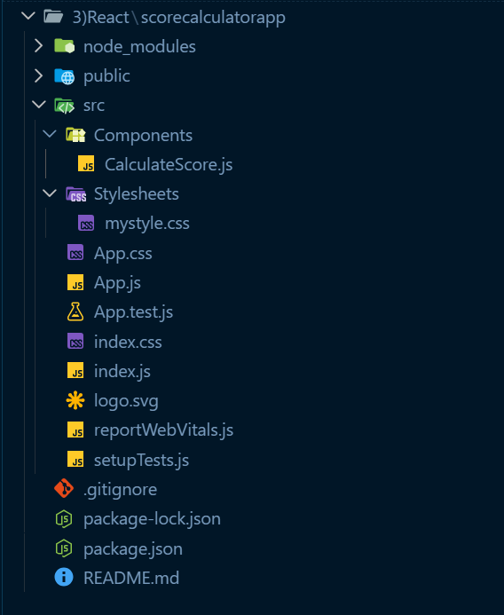
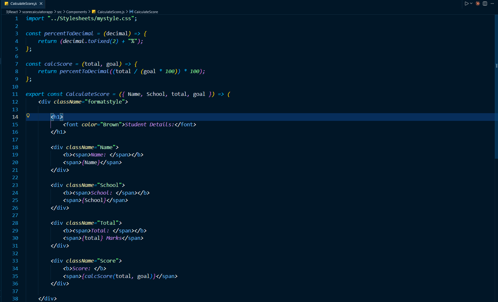
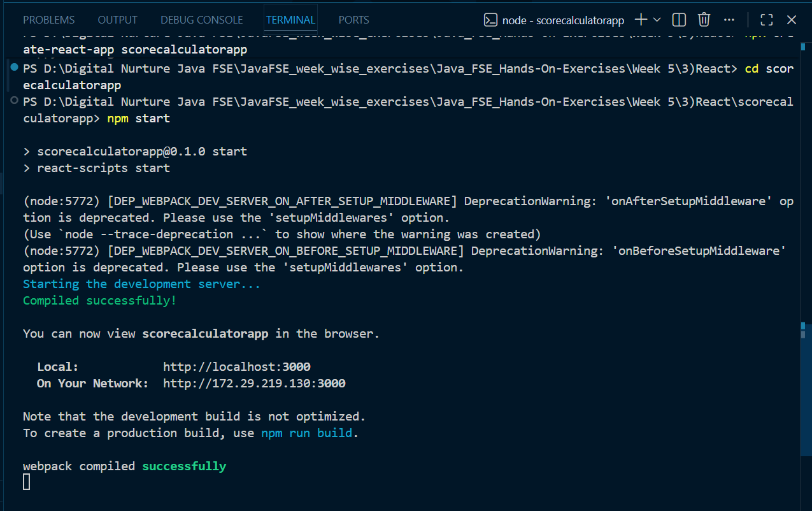
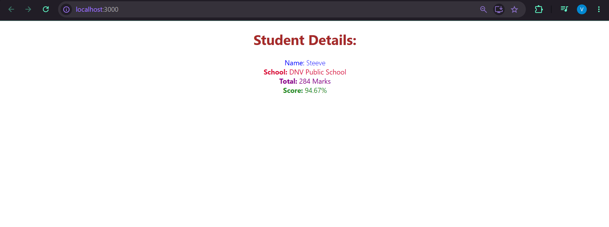

# React Hands-on Lab 3 – Creating a Functional Component with Props and CSS Styling

## Overview

This project demonstrates the creation of a **React Functional Component** that accepts data through **props**, performs a simple score calculation, and displays the result with custom CSS styling.

The application calculates and displays a student's score based on the total marks obtained and the maximum possible marks, while presenting the information in a clean and styled layout.

---

## Objectives

- Understand React Functional Components.
- Learn how to pass data using Props.
- Perform calculations inside a React component.
- Apply CSS styling to React components.
- Render a functional component from the main application.

---

## Prerequisites

Before running this project, ensure the following are installed:

- Node.js
- npm
- Visual Studio Code

---

## Technologies Used

- React
- JavaScript (ES6)
- JSX
- CSS
- HTML
- Node.js
- npm
- Create React App

---

## Project Structure

```text
scorecalculatorapp/
│
├── public/
├── src/
│   ├── Components/
│   │   └── CalculateScore.js
│   │
│   ├── Stylesheets/
│   │   └── mystyle.css
│   │
│   ├── App.js
│   ├── App.css
│   ├── index.js
│   └── ...
│
├── package.json
└── README.md
```

---

## Application Features

- Displays student information.
- Accepts data through React Props.
- Calculates the student's percentage score.
- Formats the score to two decimal places.
- Applies custom CSS styling for a better user interface.

---

## Functional Component

The `CalculateScore` component accepts the following props:

| Prop | Description |
|------|-------------|
| Name | Student Name |
| School | School Name |
| total | Total Marks Obtained |
| goal | Number of Subjects |

The component calculates the percentage using:

```text
Score = (Total Marks / (Goal × 100)) × 100
```

The calculated score is displayed with two decimal places.

---

## CSS Styling

A separate stylesheet (`mystyle.css`) is used to style:

- Student Name
- School Name
- Total Marks
- Calculated Score
- Overall page layout

This demonstrates the separation of presentation and logic in React applications.

---

## How to Run the Project

### 1. Clone the repository

```bash
git clone <repository-url>
```

### 2. Navigate to the project directory

```bash
cd scorecalculatorapp
```

### 3. Install dependencies

```bash
npm install
```

### 4. Start the development server

```bash
npm start
```

### 5. Open the application

Visit:

```text
http://localhost:3000
```

---

## Expected Output

The application displays student information similar to:

```text
Student Details

Name: Steeve

School: DNV Public School

Total: 284 Marks

Score: 94.67%
```

---

## Learning Outcomes

After completing this exercise, you will be able to:

- Create React Functional Components.
- Pass and access Props in React.
- Perform calculations within a component.
- Apply external CSS styles.
- Organize components and styles into separate folders.
- Render a functional component from the root component.

---

## Screenshots

### Project Structure



---

### CalculateScore Component



---

### CSS Stylesheet


---

### App Component


---

### Terminal Output



---

### Application Output



---

## Conclusion

This hands-on exercise introduced the concept of **React Functional Components** and demonstrated how to pass data through props, perform simple calculations, and apply external CSS styling. It reinforces React's component-based architecture while showcasing the use of reusable components and modular styling to build clean and maintainable user interfaces.  