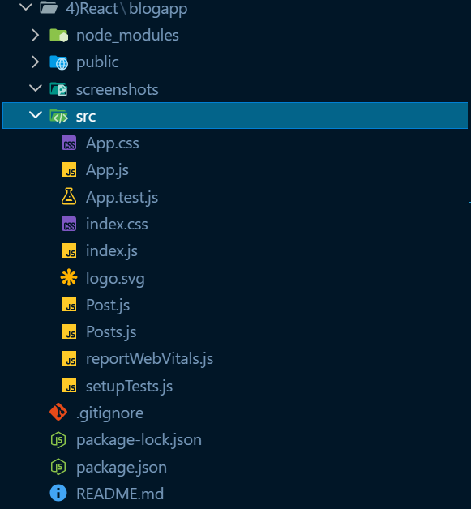
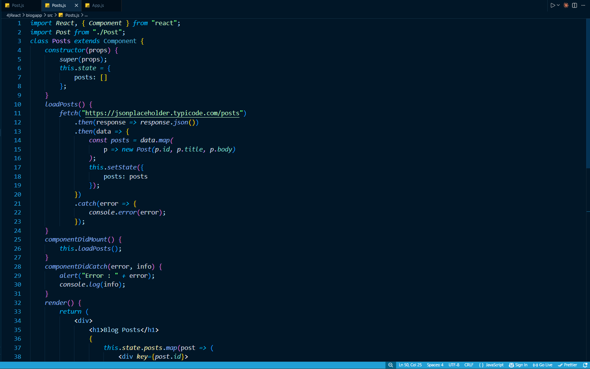
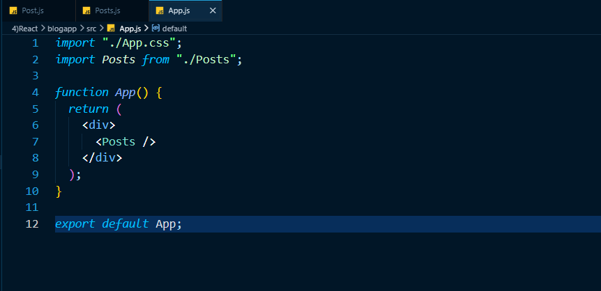
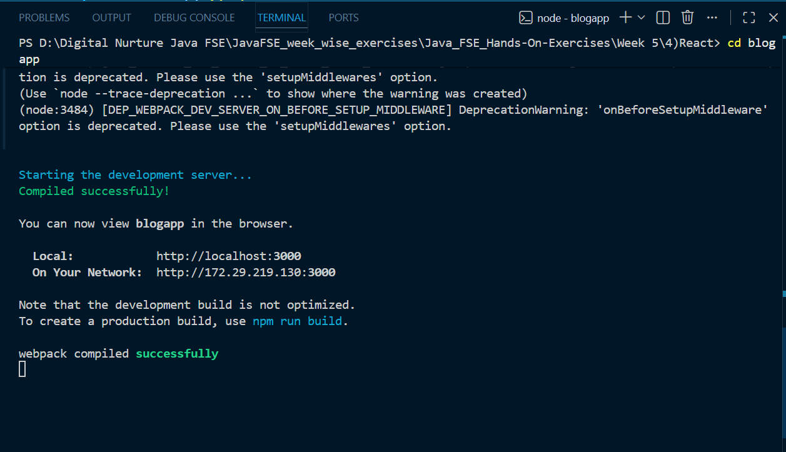
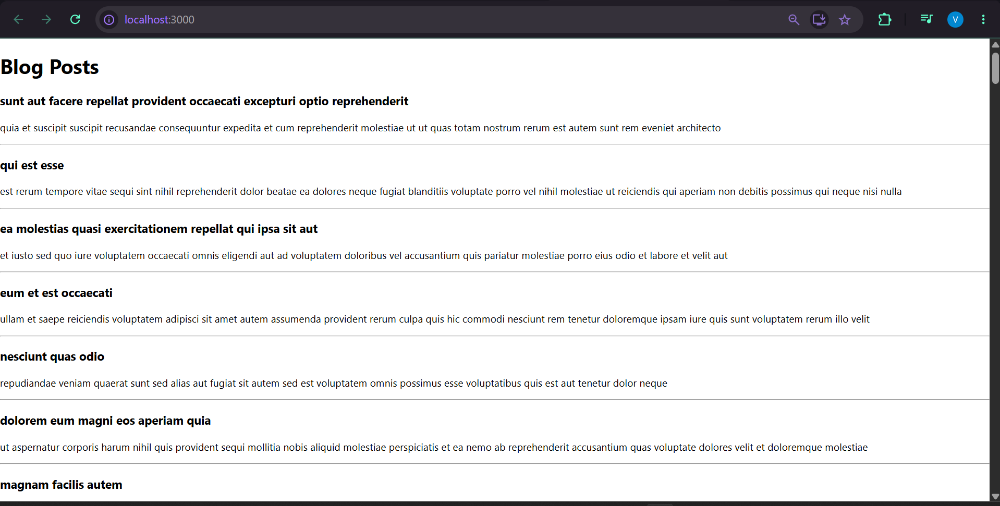

# React Hands-on Lab 4 – React Component Lifecycle Methods and Fetch API

## Overview

This project demonstrates the implementation of **React Class Component Lifecycle Methods** by fetching blog posts from a remote API using the **Fetch API**. The application retrieves a list of posts from the JSONPlaceholder REST API and displays each post's title and content.

The exercise introduces the use of **componentDidMount()** for loading data after component rendering and **componentDidCatch()** for handling component errors.

---

## Objectives

- Understand the need and benefits of React Component Lifecycle Methods.
- Learn the sequence of rendering a React component.
- Implement the `componentDidMount()` lifecycle hook.
- Implement the `componentDidCatch()` lifecycle hook.
- Fetch data from a REST API using the Fetch API.
- Display dynamic data using React state.

---

## Prerequisites

Before running this project, ensure the following are installed:

- Node.js
- npm
- Visual Studio Code

---

## Technologies Used

- React
- JavaScript (ES6)
- Fetch API
- JSX
- HTML
- CSS
- Node.js
- npm
- Create React App

---

## Project Structure

```text
blogapp/
│
├── public/
├── src/
│   ├── App.js
│   ├── App.css
│   ├── Post.js
│   ├── Posts.js
│   ├── index.js
│   └── ...
│
├── package.json
└── README.md
```

---

## Application Features

- Fetches blog posts from the JSONPlaceholder REST API.
- Stores fetched data in the component state.
- Uses the `componentDidMount()` lifecycle hook to load data.
- Handles runtime errors using `componentDidCatch()`.
- Displays each blog post with its title and body.
- Demonstrates React Class Components and state management.

---

## Lifecycle Methods Used

### componentDidMount()

- Executes automatically after the component is rendered.
- Invokes the `loadPosts()` method.
- Fetches blog post data from the REST API.

---

### componentDidCatch()

- Captures runtime errors occurring inside the component.
- Displays an alert message.
- Logs error details to the browser console.

---

## Fetch API

The application retrieves blog posts from:

```text
https://jsonplaceholder.typicode.com/posts
```

Each fetched post is converted into a `Post` object and stored in the component state before being rendered on the webpage.

---

## How to Run the Project

### 1. Clone the repository

```bash
git clone <repository-url>
```

### 2. Navigate to the project directory

```bash
cd blogapp
```

### 3. Install dependencies

```bash
npm install
```

### 4. Start the development server

```bash
npm start
```

### 5. Open the application

Visit:

```text
http://localhost:3000
```

---

## Expected Output

The application displays a list of blog posts fetched from the JSONPlaceholder API.

Each post contains:

- Blog Title
- Blog Content (Body)

Example:

```text
Blog Posts

sunt aut facere repellat provident occaecati excepturi optio reprehenderit

quia et suscipit suscipit recusandae consequuntur expedita...

------------------------------------------------------------

qui est esse

est rerum tempore vitae sequi sint nihil reprehenderit...

------------------------------------------------------------
```

---

## Learning Outcomes

After completing this exercise, you will be able to:

- Create React Class Components.
- Understand React Lifecycle Methods.
- Use `componentDidMount()` to fetch data.
- Handle component errors with `componentDidCatch()`.
- Consume REST APIs using the Fetch API.
- Store API responses inside React state.
- Render dynamic lists using `map()`.

---

## Screenshots

### Project Structure



---

### Post Class


---

### Posts Component (Constructor & State)



---

### App Component



---

### Terminal Output



---

### Application Output



---

## Conclusion

This hands-on exercise demonstrated how React Class Components interact with lifecycle methods to fetch and render dynamic data from an external REST API. By implementing `componentDidMount()` for data loading and `componentDidCatch()` for error handling, the application showcases important concepts used in real-world React applications, including asynchronous data fetching, state management, and dynamic rendering of API responses.