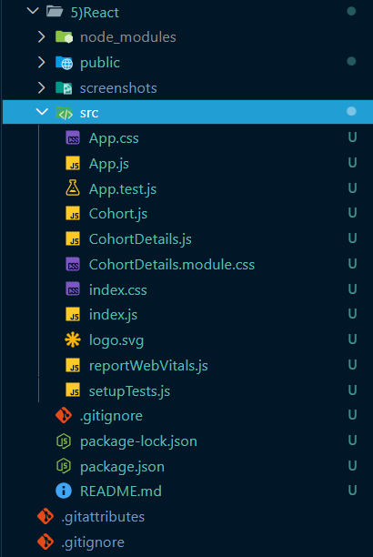
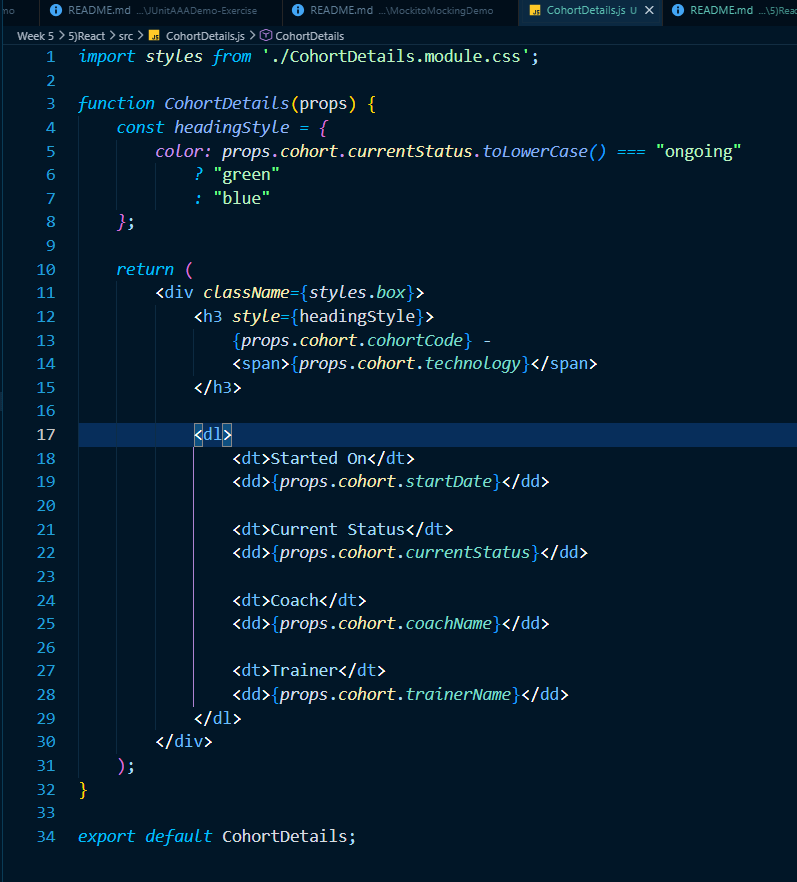
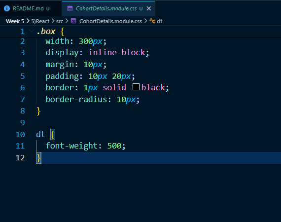
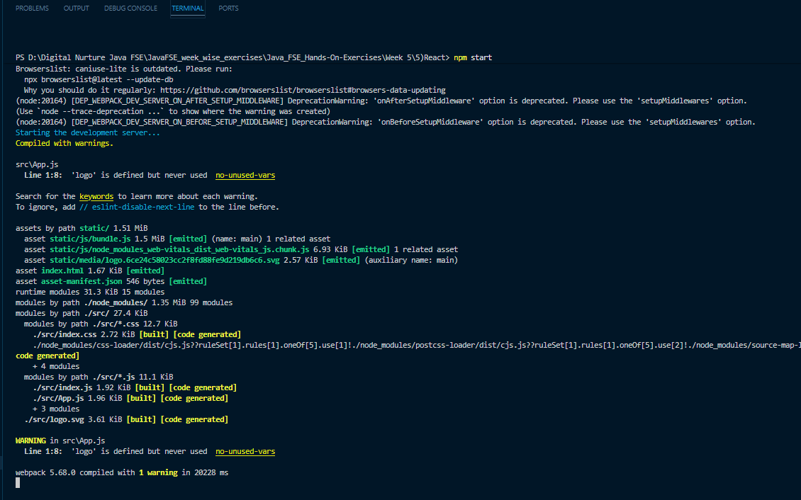
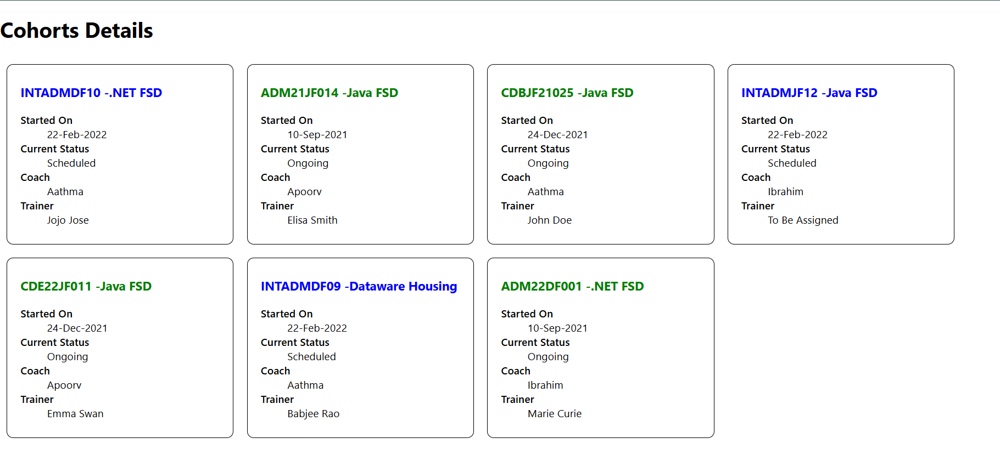

# React Hands-on Lab 5 – Styling React Components using CSS Modules and Inline Styles

## Overview

This project demonstrates how to style React components using **CSS Modules** and **Inline Styles**. The application displays details of ongoing and completed Cognizant training cohorts and applies dynamic styling based on the cohort status.

The exercise introduces component-level styling using **CSS Modules** to avoid global CSS conflicts and **Inline Styles** to conditionally render different colors for the cohort status.

---

## Objectives

- Understand the need for styling React components.
- Learn how CSS Modules provide scoped component styling.
- Apply styles using the `className` property.
- Use Inline Styles for dynamic styling.
- Style React components based on component data.

---

## Prerequisites

Before running this project, ensure the following are installed:

- Node.js
- npm
- Visual Studio Code

---

## Technologies Used

- React
- JavaScript (ES6)
- JSX
- CSS Modules
- Inline Styles
- HTML
- CSS
- Node.js
- npm
- Create React App

---

## Project Structure

```text
cohorttracker/
│
├── public/
├── src/
│   ├── App.js
│   ├── Cohort.js
│   ├── CohortDetails.js
│   ├── CohortDetails.module.css
│   ├── index.js
│   └── ...
│
├── package.json
└── README.md
```

---

## Application Features

- Displays details of multiple training cohorts.
- Styles each cohort inside a responsive card.
- Uses **CSS Modules** for component-specific styling.
- Uses **Inline Styles** to dynamically change heading colors.
- Shows **green** heading for ongoing cohorts.
- Shows **blue** heading for completed cohorts.

---

## CSS Module

A CSS Module named:

```text
CohortDetails.module.css
```

contains the styling for the cohort card.

### Box Style

The `.box` class includes:

- Width: 300px
- Display: inline-block
- Margin: 10px
- Padding: 10px 20px
- Border: 1px solid black
- Border Radius: 10px

### Definition List Styling

The `<dt>` element is styled using a tag selector with:

```css
font-weight: 500;
```

---

## Inline Styling

The `<h3>` heading color is determined dynamically based on the cohort status.

### Ongoing Cohort

```javascript
color: "green"
```

### Completed Cohort

```javascript
color: "blue"
```

The style is applied using the React `style` property.

---

## How to Run the Project

### 1. Clone the repository

```bash
git clone <repository-url>
```

### 2. Navigate to the project directory

```bash
cd cohorttracker
```

### 3. Install dependencies

```bash
npm install
```

### 4. Start the development server

```bash
npm start
```

### 5. Open the application

Visit:

```text
http://localhost:3000
```

---

## Expected Output

The application displays multiple cohort cards.

Each card contains:

- Cohort Code
- Technology
- Start Date
- Current Status
- Coach Name
- Trainer Name

### Styling

- Card with rounded border
- Proper spacing and padding
- Green heading for ongoing cohorts
- Blue heading for completed cohorts

Example:

```text
INTADMDF10 - ADM .NET FSD

Started On
22-Feb-2022

Current Status
Ongoing

Coach
John Smith

Trainer
David Warner
```

---

## Learning Outcomes

After completing this exercise, you will be able to:

- Style React components using CSS Modules.
- Apply scoped CSS without affecting other components.
- Use the `className` property to apply CSS classes.
- Apply Inline Styles in React.
- Dynamically change styles based on component properties.
- Improve the appearance and maintainability of React applications.

---

## Screenshots

### Project Structure



---

### CohortDetails Component



---

### CSS Module



---

### Terminal Output



---

### Application Output



---

## Conclusion

This hands-on exercise demonstrated how to style React components using **CSS Modules** and **Inline Styles**. By encapsulating styles within a CSS Module and dynamically applying styles using React's `style` property, the application achieves clean, maintainable, and reusable component styling. These techniques are widely used in modern React applications to build scalable and visually appealing user interfaces.