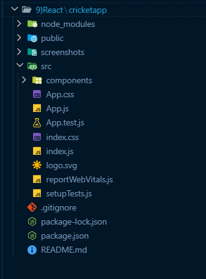
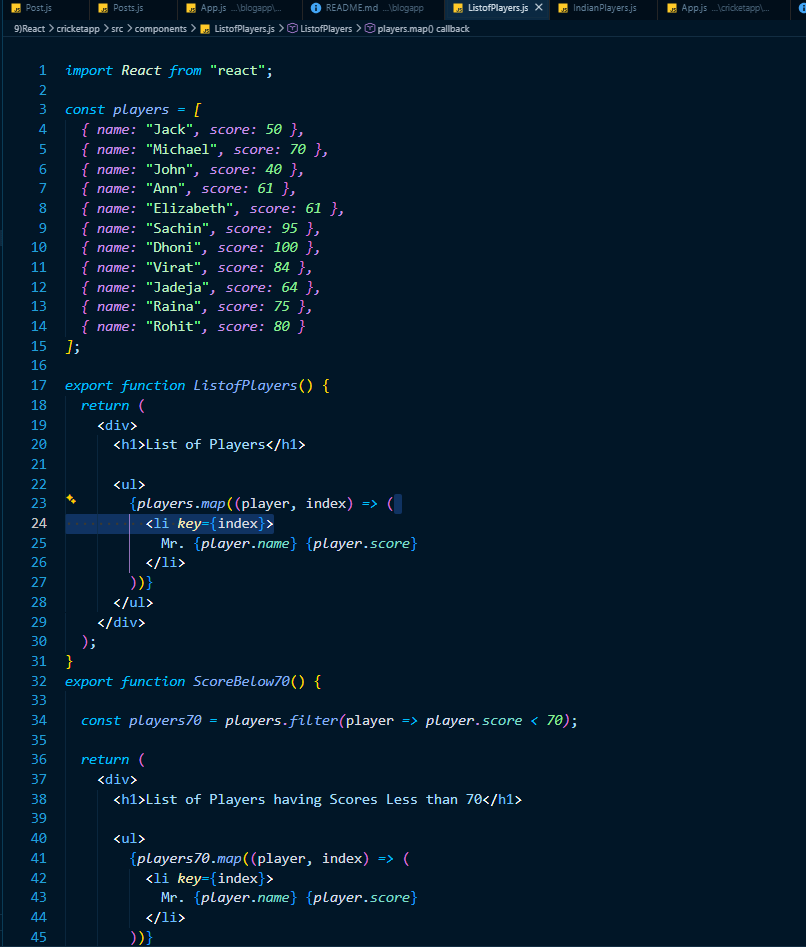
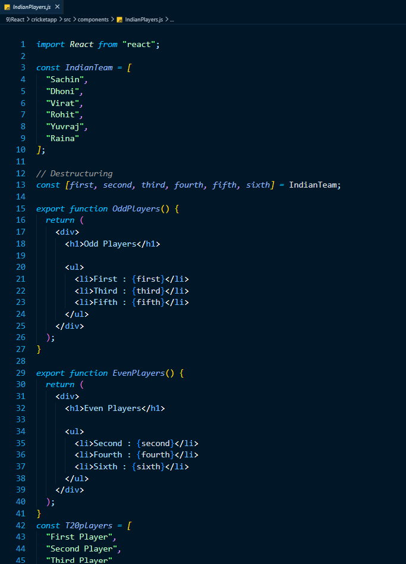
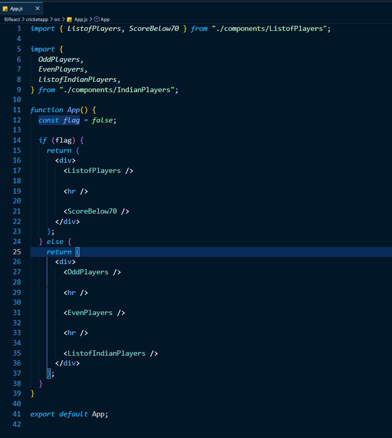
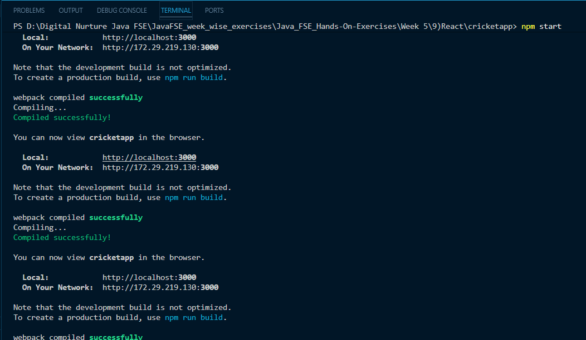
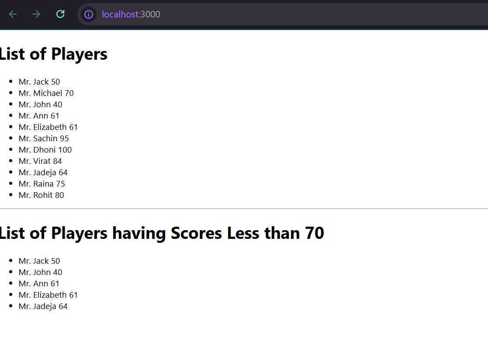
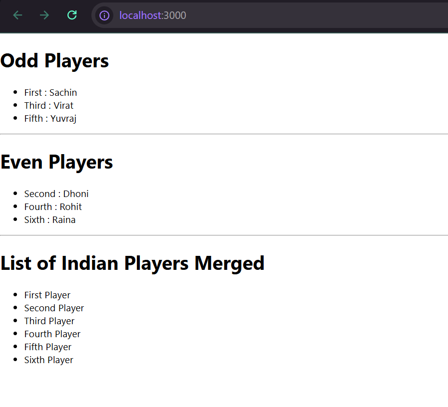

# React Hands-on Lab 6 – Exploring ES6 Features in React

## Overview

This project demonstrates the use of modern **ECMAScript 6 (ES6)** features within a React application. The application displays cricket player information using ES6 concepts such as **map(), filter(), arrow functions, destructuring, spread operator, and conditional rendering**.

The exercise consists of two React components:

- **ListofPlayers** – Displays a list of cricket players and filters players with scores below 70.
- **IndianPlayers** – Demonstrates array destructuring to display odd and even players separately and uses the spread operator to merge two arrays.

---

## Objectives

- Understand the features introduced in ES6.
- Use the `map()` method to render lists in React.
- Apply Arrow Functions for concise function syntax.
- Filter data using ES6 array methods.
- Learn Array Destructuring.
- Merge arrays using the Spread Operator.
- Implement Conditional Rendering using a flag variable.

---

## Prerequisites

Before running this project, ensure the following are installed:

- Node.js
- npm
- Visual Studio Code

---

## Technologies Used

- React
- JavaScript (ES6)
- JSX
- HTML
- CSS
- Node.js
- npm
- Create React App

---

## Project Structure

```text
cricketapp/
│
├── public/
│
├── src/
│   ├── components/
│   │     ├── ListofPlayers.js
│   │     └── IndianPlayers.js
│   │
│   ├── App.js
│   ├── index.js
│   └── ...
│
├── package.json
└── README.md
```

---

## Application Features

### List of Players

- Stores details of 11 cricket players.
- Displays the player names and scores using the ES6 `map()` method.
- Filters and displays players having scores below **70** using the `filter()` method and Arrow Functions.

### Indian Players

- Uses **Array Destructuring** to separate odd and even positioned players.
- Displays odd and even players independently.
- Merges two arrays (T20 Players and Ranji Trophy Players) using the **Spread Operator**.
- Displays the merged list of players.

### Conditional Rendering

- Uses a boolean `flag` variable.
- When `flag = true`, the application displays the player list and filtered players.
- When `flag = false`, the application displays odd players, even players, and the merged player list.

---

# ES6 Concepts Demonstrated

## 1. map()

Used to iterate through the players array and render each player.

Example:

```javascript
players.map((player) => (
    <li>{player.name} {player.score}</li>
))
```

---

## 2. Arrow Functions

Used throughout the application for concise function syntax.

Example:

```javascript
player => player.score < 70
```

---

## 3. filter()

Filters players whose scores are less than 70.

Example:

```javascript
const playersBelow70 = players.filter(player => player.score < 70);
```

---

## 4. Array Destructuring

Extracts players into separate variables.

Example:

```javascript
const [first, second, third, fourth, fifth, sixth] = IndianTeam;
```

---

## 5. Spread Operator

Merges multiple arrays into a single array.

Example:

```javascript
const IndianPlayers = [...T20Players, ...RanjiPlayers];
```

---

## 6. Conditional Rendering

Uses a simple `if-else` statement to display different components.

Example:

```javascript
if(flag){
    return <ListofPlayers />
}
else{
    return <IndianPlayers />
}
```

---

## How to Run the Project

### 1. Clone the repository

```bash
git clone <repository-url>
```

### 2. Navigate to the project directory

```bash
cd cricketapp
```

### 3. Install dependencies

```bash
npm install
```

### 4. Start the development server

```bash
npm start
```

### 5. Open the application

Visit:

```text
http://localhost:3000
```

---

## Expected Output

### When `flag = true`

The application displays:

- List of all cricket players.
- Player names with their scores.
- List of players whose scores are below 70.

Example:

```text
List of Players

Mr. Jack 50
Mr. Michael 70
Mr. John 40
Mr. Ann 61
Mr. Elizabeth 61
...

List of Players having Scores Less than 70

Mr. Jack 50
Mr. John 40
Mr. Ann 61
Mr. Elizabeth 61
Mr. Jadeja 64
```

---

### When `flag = false`

The application displays:

- Odd Players
- Even Players
- Merged Indian Players List

Example:

```text
Odd Players

First : Sachin
Third : Virat
Fifth : Yuvraj

Even Players

Second : Dhoni
Fourth : Rohit
Sixth : Raina

List of Indian Players Merged

First Player
Second Player
Third Player
Fourth Player
Fifth Player
Sixth Player
```

---

## Learning Outcomes

After completing this exercise, you will be able to:

- Use the ES6 `map()` method to render lists in React.
- Filter data using the `filter()` method.
- Write concise functions using Arrow Functions.
- Apply Array Destructuring.
- Merge arrays using the Spread Operator.
- Implement Conditional Rendering in React.
- Organize React applications using reusable components.
- Build cleaner and more readable React code using ES6 features.

---

## Screenshots

### Project Structure



---

### ListofPlayers Component



---

### IndianPlayers Component



---

### App Component



---

### Terminal Output



---

### Application Output (Flag = true)



---

### Application Output (Flag = false)



---

## Conclusion

This hands-on exercise demonstrated the practical use of several **ES6 features** within a React application. By leveraging **map(), filter(), arrow functions, array destructuring, spread operator, and conditional rendering**, the application becomes more concise, readable, and maintainable. These ES6 concepts form the foundation of modern React development and are essential for building scalable and efficient user interfaces.