# Git Hands-on

This repository contains the Git Hands-on exercise completed as part of the **Cognizant Digital Nurture Program**.

---

## Objectives

- Configure Git on the local machine.
- Configure global Git username and email.
- Initialize a local Git repository.
- Create and track files using Git.
- Commit changes to the local repository.
- Connect the local repository to GitHub.
- Push the local repository to GitHub.

---

# Environment

| Tool | Version |
|------|---------|
| Git | 2.47.1 |
| OS | Windows 11 |
| Git Bash | MINGW64 |
| Remote Repository | GitHub |

---

# Project Structure

```text
GitDemo/
│
├── README.md
├── welcome.txt
└── screenshots/
```

---

# Step 1 - Verify Git Installation

```bash
git --version
```

### Output

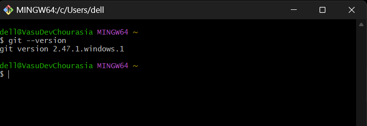

---

# Step 2 - Verify Global Git Configuration

```bash
git config --global --list
```

### Output

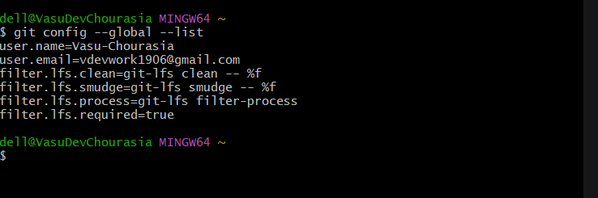

---

# Step 3 - Initialize Git Repository

Initially Git was initialized in the home directory.

```bash
git init
```

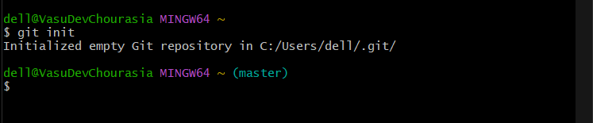

---

# Step 4 - Navigate to Project Directory

```bash
cd "D:\Digital Nurture Java FSE\git handson"
```

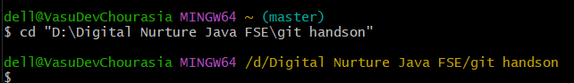

---

# Step 5 - Create GitDemo Directory

```bash
mkdir GitDemo
```

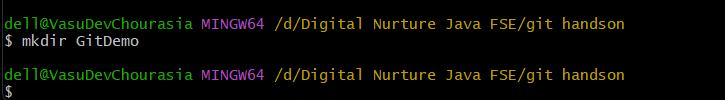

---

# Step 6 - Initialize Repository

```bash
git init
```


---

# Step 7 - Create welcome.txt

```bash
echo "Welcome to the version control" >> welcome.txt
```

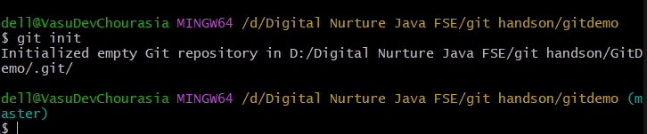

---

# Step 8 - Commit Changes

```bash
git add welcome.txt

git commit -m "Initial commit"
```

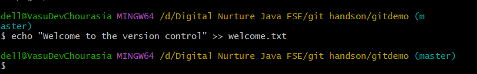

---

# Step 9 - Configure Remote Repository

```bash
git remote add origin https://github.com/Vasu-Chourasia/GitDemo.git
```

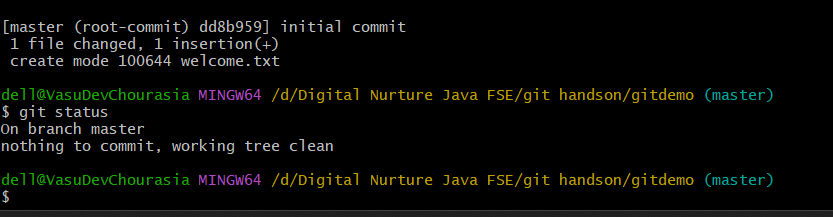

---

# Step 10 - Verify Remote

```bash
git remote -v
```

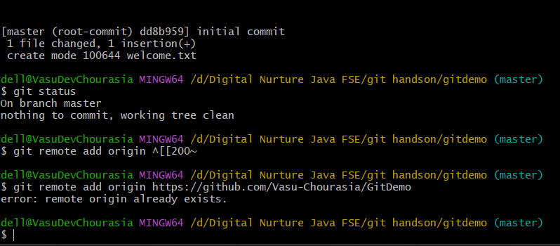

---

# Step 11 - Troubleshooting

While pushing the repository, the following issues were encountered:

- Remote already exists.
- Attempted to push from the wrong directory.
- Corrected the working directory and remote configuration.

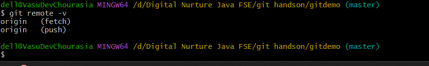

---

# Step 12 - Verify Branch

```bash
git branch
```

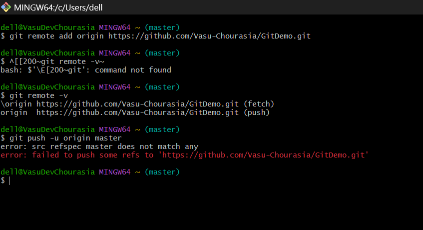

---

# Step 13 - Push Repository to GitHub

```bash
git push -u origin master
```

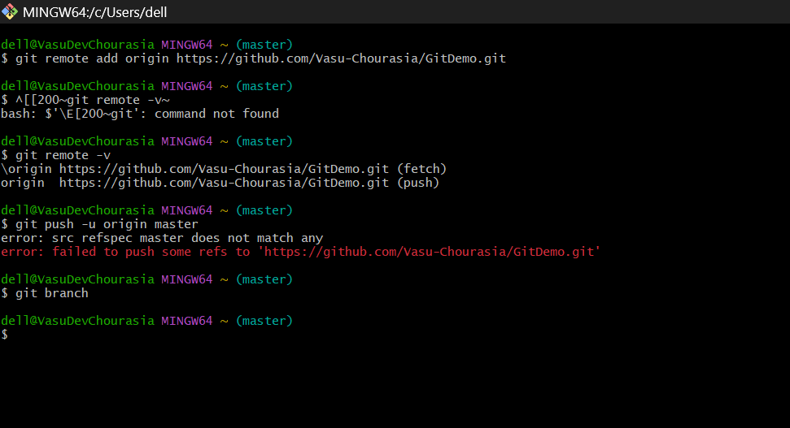

---

# Step 14 - GitHub Repository

Final repository after successfully pushing the project.


---

# Learning Outcomes

- Learned Git installation and configuration.
- Initialized a Git repository.
- Added files to the staging area.
- Created commits.
- Connected a local repository to GitHub.
- Pushed commits to a remote repository.
- Understood common Git errors and their solutions.
